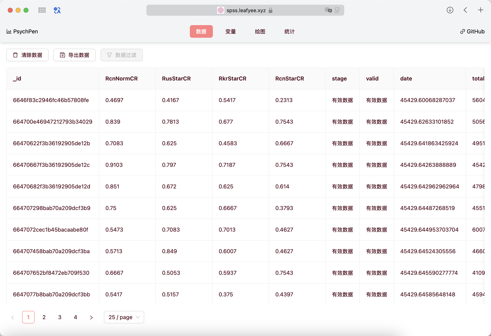
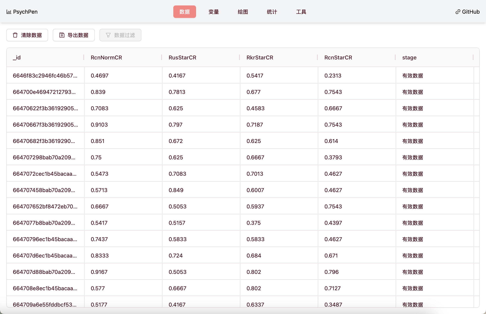
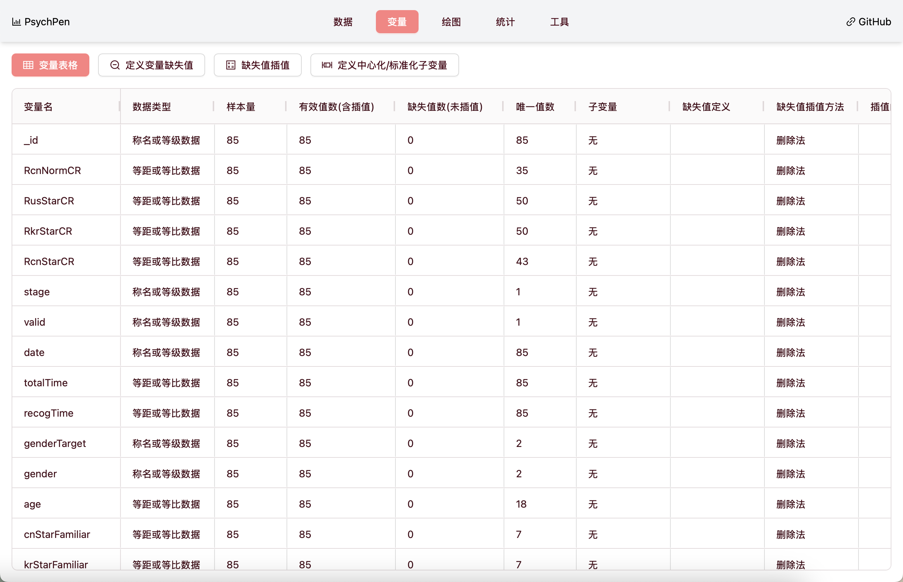
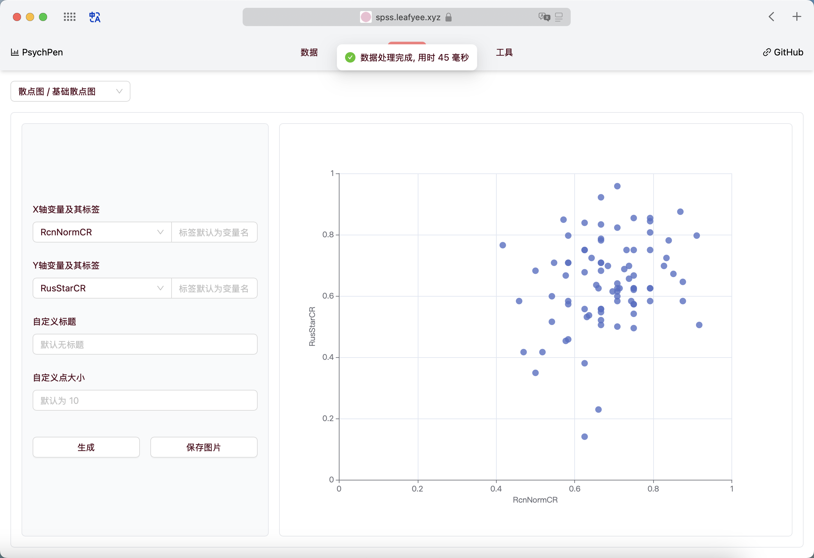

# PsychPen

**在线进行心理学统计分析和绘制统计图表**

|  |  |
| :---: | :---: |
|  |  |

## 项目说明

本项目是一个使用 `TypeScript` 语言编写, 用于心理学/教育学统计检验分析和图表绘制的在线工具; 相比于传统的心理学统计软件, 本项目具有**无需下载安装**、**跨平台**、**开源免费**、**新手友好**等优势; 由于图表绘制基于 `antv`, 因此相比于 `SPSS` 等软件, 本项目的图表更加美观、易于定制和导出

如果您对本项目感兴趣, 欢迎 `star`、`fork`、`watch` 或者提出 `issue` 和 `pull request`!

## 开发说明

1. 克隆本项目到本地
  ```bash
  git clone https://github.com/LeafYeeXYZ/PsychPen.git
  cd PsychPen
  ```
2. 安装依赖 (本项目使用 [bun](https://bun.sh) 作为包管理工具)
  ```bash
  bun install
  ```
1. 启动项目
  ```bash
  bun dev
  ```
1. 打包项目
  ```bash
  bun run build
  ```

## 路线图

- **数据管理**
  - [x] 数据导入 (基于 `sheet.js`)
  - [x] 数据和变量预览 
  - [x] 支持导入 `.sav` 文件 (基于 [mhermher/savvy](https://github.com/mhermher/savvy) `但是不知道为什么不能直接安装, 只能手动下载源码`)
  - [ ] 支持新建文件导入 (`csv` 文本) 和打开示例数据
  - [x] 数据导出 (基于 `sheet.js`)
  - [x] 基础的缺失值定义 
  - [ ] 缺失值插值处理 (当前为删除法)
- **绘图功能** (基于 `echarts`)
  - 箱线图
    - [x] 基础箱线图
  - 散点图
    - [x] 基础散点图
  - [x] 图像导出 (基于 `html2canvas`)
- **统计功能** (近期基于 `@stdlib/stdlib` 库, 远期基于 `WebAssembly` (`pyodide` / `AssemblyScript`) 实现)
  - t 检验
    - [x] 单样本 t 检验
    - [ ] 独立样本 t 检验
    - [x] 配对样本 t 检验
  - [ ] 输出统计表对应的 `TeX` 代码
