- [ ] TODO: `webr v0.5.7+` 与 `vite` 存在兼容性问题, 暂时回退到 `v0.5.6`, 等待 `webr` 修复后再升级

# PsychPen

**AI加持的在线统计分析和数据可视化软件**, 立即体验: <https://psychpen.leafyee.xyz>

| 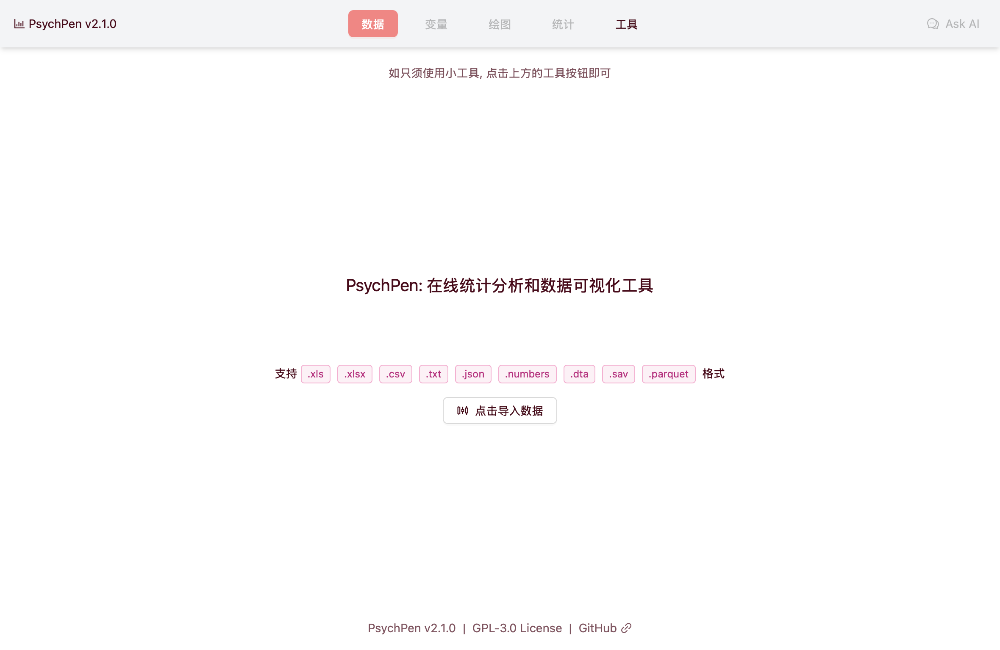  | 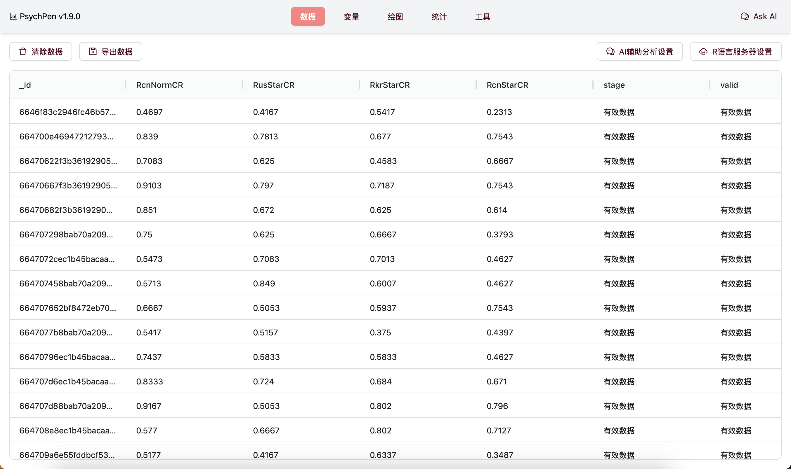  |  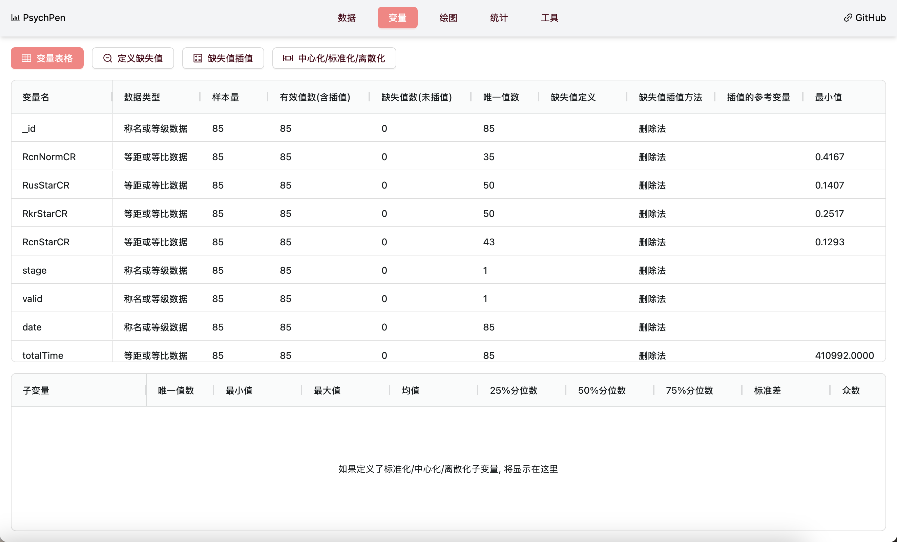  |
| :---------------------: | :---------------------: | :---------------------: |
| 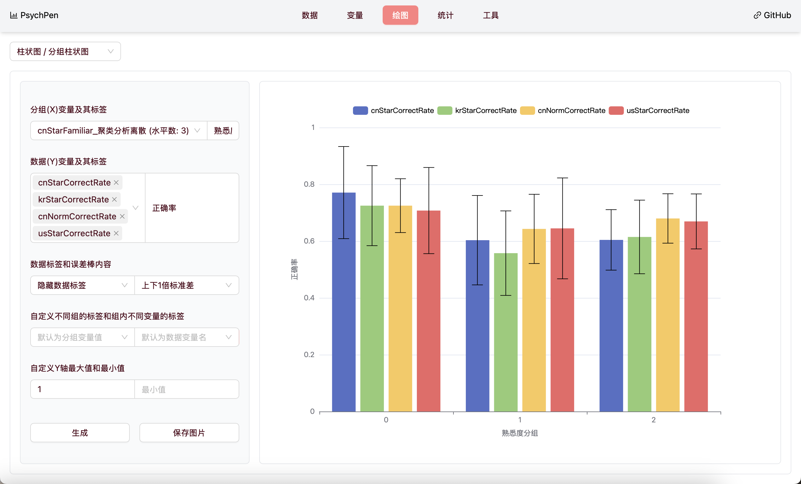 | 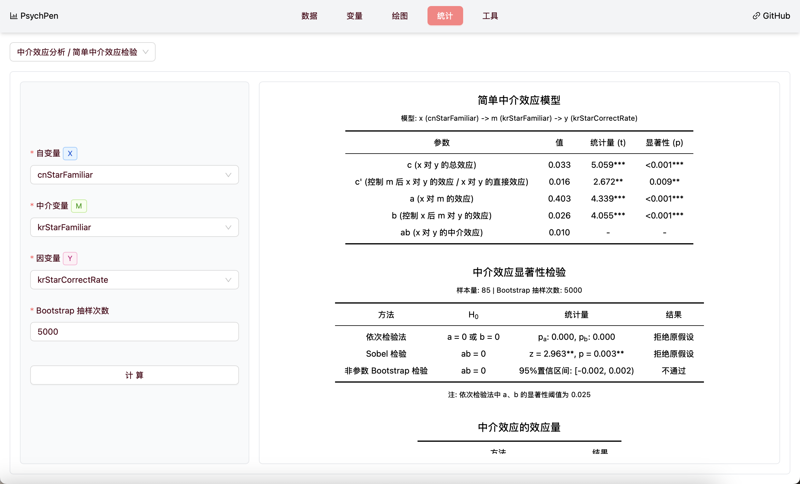 | 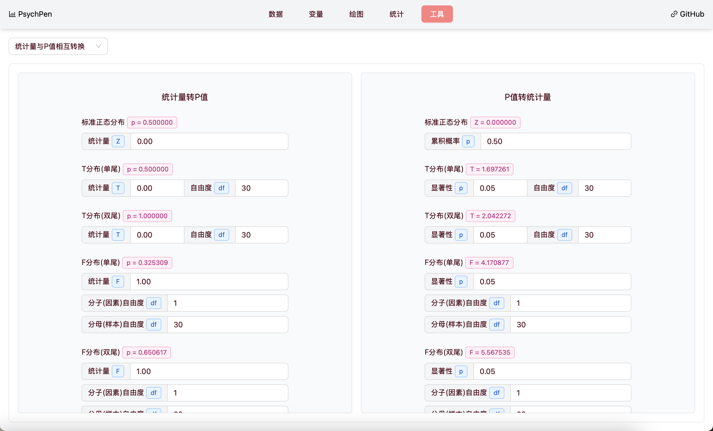 |
| 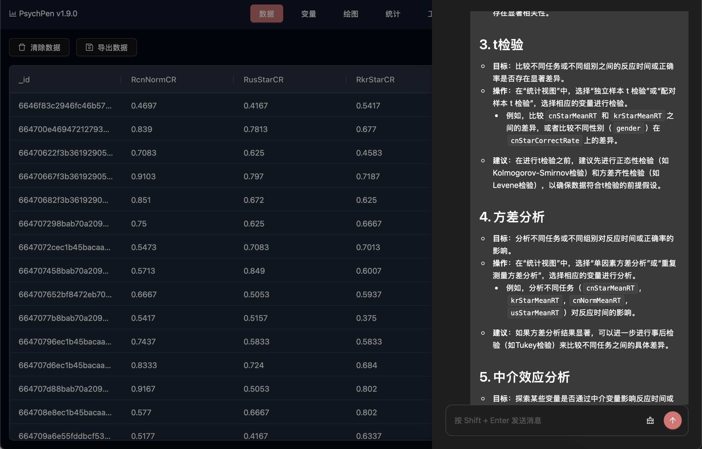  | 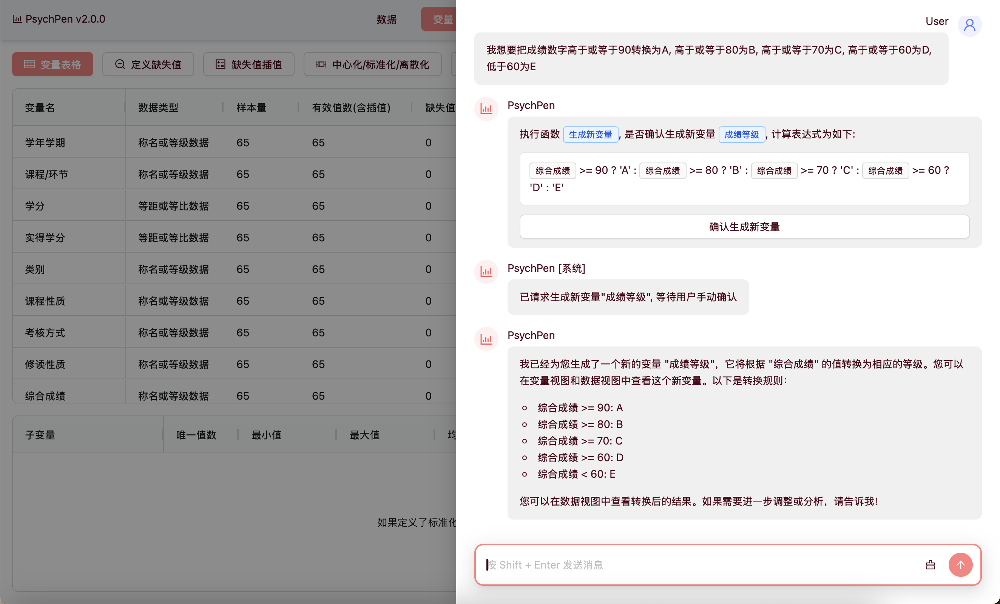  | 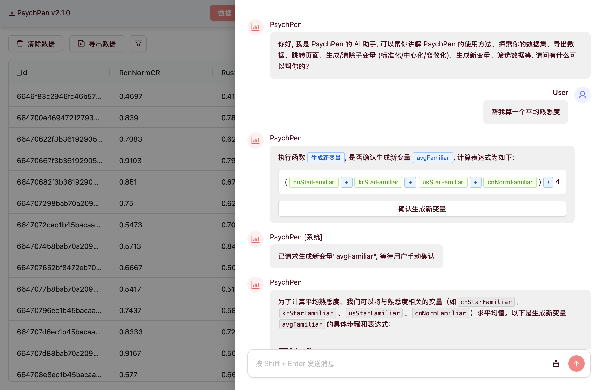 |

> 文档更新可能滞后于软件版本更新, 请以软件实际功能为准

## 引用信息

如果你在学术论文中使用了 PsychPen, 请引用以下信息 (APA格式) (请注意年份和版本号区别)

- `v2.0.0-最新版本`: `叶一杉. (2025). PsychPen: AI加持的在线统计分析和数据可视化工具 (v2.x.0) [Computer software]. GitHub. https://github.com/LeafYeeXYZ/PsychPen/tree/v2.x.0`
- `v1.9.0`: `叶一杉. (2025). PsychPen: 在线统计分析和数据可视化工具 (v1.9.0) [Computer software]. GitHub. https://github.com/LeafYeeXYZ/PsychPen/tree/v1.9.0`
- `v1.0.0-v1.8.0`: `叶一杉. (2024). PsychPen: 在线统计分析和数据可视化工具 (v1.x.0) [Computer software]. GitHub. https://github.com/LeafYeeXYZ/PsychPen/tree/v1.x.0`

## 目录

- [PsychPen](#psychpen)
  - [引用信息](#引用信息)
  - [目录](#目录)
- [PsychPen 使用文档](#psychpen-使用文档)
  - [1 项目简介](#1-项目简介)
  - [2 数据视图](#2-数据视图)
    - [2.1 数据导入](#21-数据导入)
    - [2.2 数据预览/导出/删除](#22-数据预览导出删除)
    - [2.4 AI辅助分析设置](#24-ai辅助分析设置)
    - [2.5 AI助手使用示例](#25-ai助手使用示例)
      - [2.5.1 让AI助手操作数据导出](#251-让ai助手操作数据导出)
      - [2.5.2 让AI助手操作变量标准化](#252-让ai助手操作变量标准化)
      - [2.5.3 让AI助手操作计算变量](#253-让ai助手操作计算变量)
      - [2.5.4 让AI助手操作数据筛选](#254-让ai助手操作数据筛选)
      - [2.5.5 询问AI助手数据分析建议](#255-询问ai助手数据分析建议)
      - [2.5.6 让AI助手介绍PsychPen](#256-让ai助手介绍psychpen)
      - [2.5.7 让AI助手解释统计结果](#257-让ai助手解释统计结果)
  - [3 变量视图](#3-变量视图)
    - [3.1 变量预览](#31-变量预览)
    - [3.2 定义缺失值](#32-定义缺失值)
    - [3.3 缺失值插值](#33-缺失值插值)
    - [3.4 中心化/标准化/离散化](#34-中心化标准化离散化)
    - [3.5 数据筛选](#35-数据筛选)
    - [3.6 生成新变量](#36-生成新变量)
    - [3.7 表达式语法](#37-表达式语法)
      - [3.7.1 变量相关语法](#371-变量相关语法)
      - [3.7.2 计算相关语法](#372-计算相关语法)
      - [3.7.3 判断相关语法](#373-判断相关语法)
  - [4 绘图视图](#4-绘图视图)
    - [4.1 折线图](#41-折线图)
      - [4.1.1 基础折线图](#411-基础折线图)
      - [4.1.2 平行折线图](#412-平行折线图)
      - [4.1.3 堆叠折线图](#413-堆叠折线图)
    - [4.2 散点图](#42-散点图)
      - [4.2.1 基础散点图](#421-基础散点图)
      - [4.2.2 三维散点图](#422-三维散点图)
    - [4.3 直方图/柱状图](#43-直方图柱状图)
      - [4.3.1 基础柱状图](#431-基础柱状图)
      - [4.3.2 三维柱状图](#432-三维柱状图)
      - [4.3.3 分组柱状图](#433-分组柱状图)
    - [4.4 箱线图](#44-箱线图)
      - [4.4.1 基础箱线图](#441-基础箱线图)
    - [4.5 饼图](#45-饼图)
      - [4.5.1 基础饼图](#451-基础饼图)
    - [4.6 其他](#46-其他)
      - [4.6.1 词云图](#461-词云图)
      - [4.6.2 Q-Q 图](#462-q-q-图)
  - [5 统计视图](#5-统计视图)
    - [5.1 描述统计](#51-描述统计)
    - [5.2 t 检验](#52-t-检验)
      - [5.2.1 单样本 t 检验](#521-单样本-t-检验)
      - [5.2.2 配对样本 t 检验](#522-配对样本-t-检验)
      - [5.2.3 独立样本 t 检验](#523-独立样本-t-检验)
      - [5.2.4 不等方差 t 检验 (Welch's t 检验)](#524-不等方差-t-检验-welchs-t-检验)
    - [5.3 方差分析](#53-方差分析)
      - [5.3.1 单因素方差分析](#531-单因素方差分析)
      - [5.3.2 重复测量方差分析](#532-重复测量方差分析)
    - [5.4 非参数检验](#54-非参数检验)
      - [5.4.1 Kolmogorov-Smirnov 检验](#541-kolmogorov-smirnov-检验)
      - [5.4.2 Levene 检验](#542-levene-检验)
      - [5.4.3 峰度和偏度检验](#543-峰度和偏度检验)
    - [5.5 相关和回归](#55-相关和回归)
      - [5.5.1 Pearson 相关检验](#551-pearson-相关检验)
      - [5.5.2 一元线性回归](#552-一元线性回归)
      - [5.5.3 多元线性回归](#553-多元线性回归)
    - [5.6 信度分析](#56-信度分析)
      - [5.6.1 重测信度/复本信度](#561-重测信度复本信度)
      - [5.6.2 分半信度](#562-分半信度)
      - [5.6.3 同质性信度](#563-同质性信度)
    - [5.7 中介效应分析](#57-中介效应分析)
      - [5.7.1 简单中介效应检验](#571-简单中介效应检验)
  - [6 工具视图](#6-工具视图)
    - [6.1 统计量与P值转换工具](#61-统计量与p值转换工具)
    - [6.2 正态分布可视化演示工具](#62-正态分布可视化演示工具)
    - [6.3 T分布可视化演示工具](#63-t分布可视化演示工具)
- [PsychPen 开发文档](#psychpen-开发文档)
  - [1 项目结构](#1-项目结构)
  - [2 开发说明](#2-开发说明)
  - [3 参考文献](#3-参考文献)

# PsychPen 使用文档

## 1 项目简介

PsychPen 是一个AI加持的在线统计分析和数据可视化软件. 相比于传统的心理学统计软件, PsychPen 具有以下优势:

- **无需下载安装**: PsychPen 直接在浏览器中运行, 支持电脑、平板、手机等多种设备
- **跨平台**: 可以在 Windows、macOS、Linux、iPadOS、iOS、HarmonyOS 等多种系统中运行
- **初学者友好**: PsychPen 交互设计优良, 操作简单, 文档齐全
- **与AI深度集成**: PsychPen 具有内置的、与各个模块深度集成的 AI 辅助功能, 让使用者能通过自然语言完成统计处理和分析
- **功能丰富**: 具有统计分布动态抽样演示、统计量与P值转换、交互式3D图表、词云图等独特功能
- **开源免费**: PsychPen 是开源项目, 你可以在遵守开源协议的前提下自由使用、修改、分发, 也欢迎你参与到项目的开发中

PsychPen 有 `数据`、`变量`、`绘图`、`统计`、`工具` 五大主要功能模块, 以及 `AI辅助分析` 和 `R语言运行器` (基于 `WebAssembly` 和 `webR` 项目) 两大独立辅助模块, 本文档将分别介绍它们的使用方法

## 2 数据视图

数据视图包含数据导入导出功能和一些软件设置

### 2.1 数据导入

进入 PsychPen 主页, 通过点击 `点击导入数据` 按钮, 选择你的数据文件 (支持 `.csv`, `.xlsx`, `.dta`, `.parquet`, `.sav`, `.json`, `.numbers` 等格式) 即可导入数据. 导入成功后, 你可以在数据视图中看到你的数据表格

|         导入前         |         导入后         |
| :--------------------: | :--------------------: |
|  |  |

### 2.2 数据预览/导出/删除

导入数据后, 你可以在数据视图中查看数据表格. 点击表头可以对数据进行排序; 按住并拖动表头的竖线可以调整列宽; 按住并拖动表头单元格可以调整列的顺序. 如果在变量视图定义了数据筛选规则, 还可以点击上方漏斗图标查看当前生效的数据筛选表达式

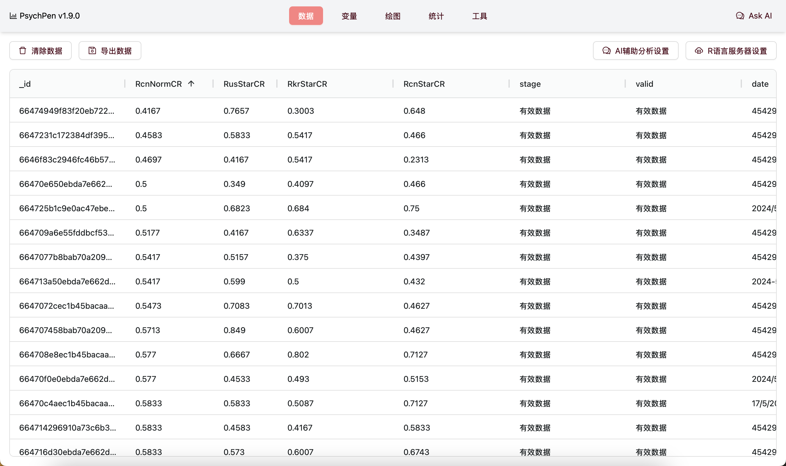

点击左上角 `导出数据` 按钮, 在弹窗中输入文件名 (也可以留空) 并选择你要导出的数据格式 (支持 `.csv`, `.xlsx`, `.numbers`, `.json`), 点击 `确定` 即可导出数据

导出的数据是经过 `定义缺失值`、`缺失值插值`、`生成标准化/中心化/离散化子变量`、`数据筛选` 等处理后的数据, 即在数据视图实际显示的数据

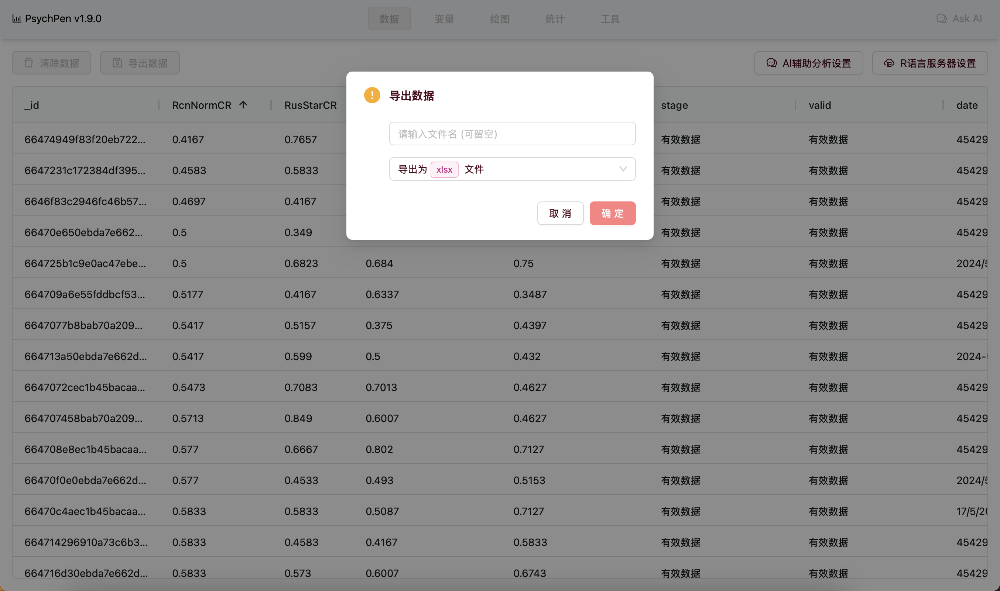

点击左上角 `删除数据` 按钮, 在确认框中确认删除即可删除当前的数据表格. 删除数据的操作仅将数据从 PsychPen 内部移除, 不会影响到数据的原始文件. 删除后, 你可以重新导入数据 (注: 网页刷新不会使数据丢失, 必须先删除原数据才能导入新数据)

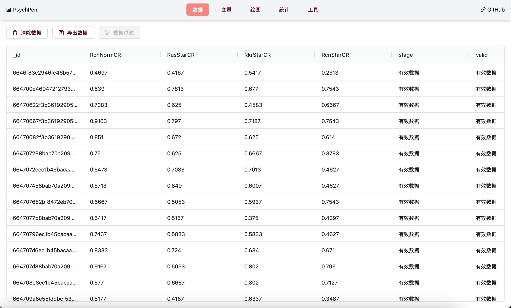

### 2.4 AI辅助分析设置

PsychPen 创新性地引入了 AI 辅助分析功能, 可以让 AI 助手基于你的数据和需求, 针对性地给出建议或直接替你操作 PsychPen 完成变量处理、统计分析和图表绘制

PsychPen 支持所有实现了 [function calling](https://platform.openai.com/docs/guides/function-calling) 并兼容 OpenAI API 规范的大语言模型 (如 [DeepSeek-V3](https://platform.deepseek.com/)、[GPT-4o](https://platform.openai.com/docs/guides)、[Qwen-max](https://bailian.console.aliyun.com/#/model-market)), 你只需根据你所用的 AI 模型提供商的使用文档, 在右上角的 `AI辅助分析设置` 中点击 `开启AI辅助分析` 按钮, 并填写 `baseUrl`、`apiKey`、`modelId` 等参数, 之后点击 `确认` 按钮, 即可点击页面右上角的 `Ask AI` 按钮, 与 AI 助手进行交互

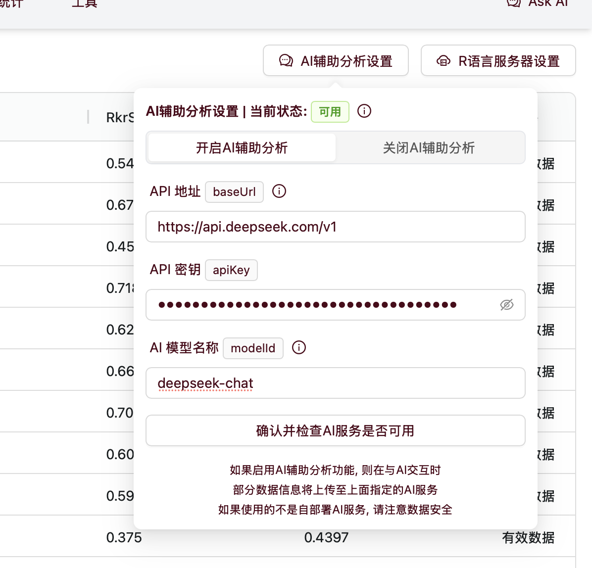

### 2.5 AI助手使用示例

在根据[2.4 AI辅助分析设置](#24-ai辅助分析设置) 设置好 AI 辅助分析后, 你可以点击右上角的 `Ask AI` 按钮, 与 AI 助手进行交互. 你可以询问它 PsychPen 的使用方法、对你的数据的见解、统计分析的建议等, 也可以直接指示它帮你操作 PsychPen 完成数据导出、变量处理、统计分析、图表绘制等操作

> 注: 以下所有示例操作如果使用性能更强/弱的AI模型, 可能会得到更好/差的效果

#### 2.5.1 让AI助手操作数据导出

> 以下示例使用 `qwen-plus-latest` (`2025.01.17` 更新版本) 模型


#### 2.5.2 让AI助手操作变量标准化

> 以下示例使用 `qwen-plus-latest` (`2025.01.17` 更新版本) 模型


#### 2.5.3 让AI助手操作计算变量

> 以下示例使用 `deepseek-chat` (`deepseek-v3-0324` 版本) 模型


#### 2.5.4 让AI助手操作数据筛选

> 以下示例使用 `qwen-plus-latest` (`2025.01.17` 更新版本) 模型

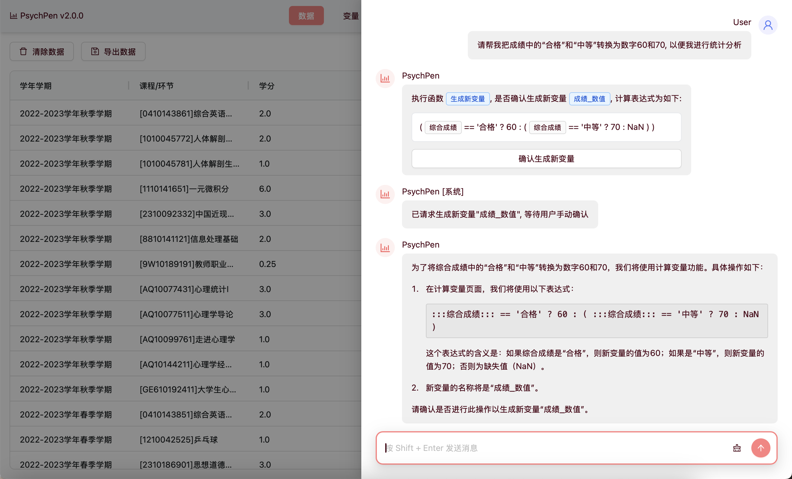

#### 2.5.5 询问AI助手数据分析建议

> 以下示例使用 `qwen-plus-latest` (`2025.01.17` 更新版本) 模型

| 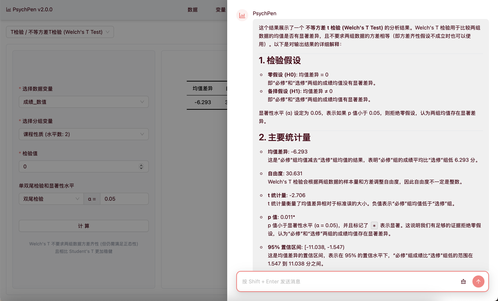 | 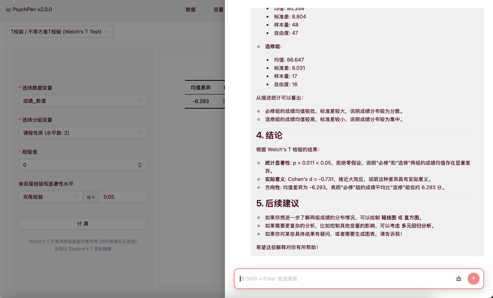 |
| :---------------------: | :---------------------: |

#### 2.5.6 让AI助手介绍PsychPen

> 以下示例使用 `qwen-plus-latest` (`2025.01.17` 更新版本) 模型

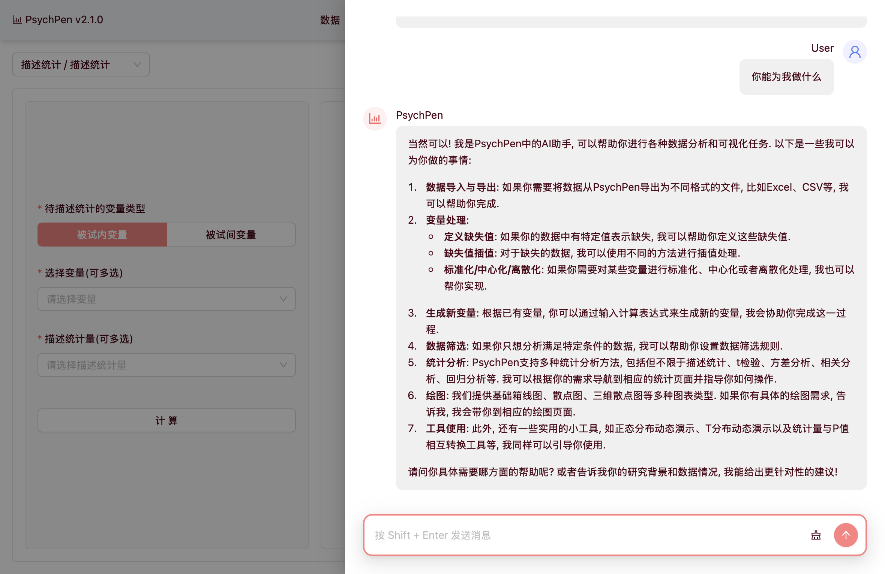

#### 2.5.7 让AI助手解释统计结果

> 以下示例使用 `deepseek-chat` (`deepseek-v3-0324` 版本) 模型

| 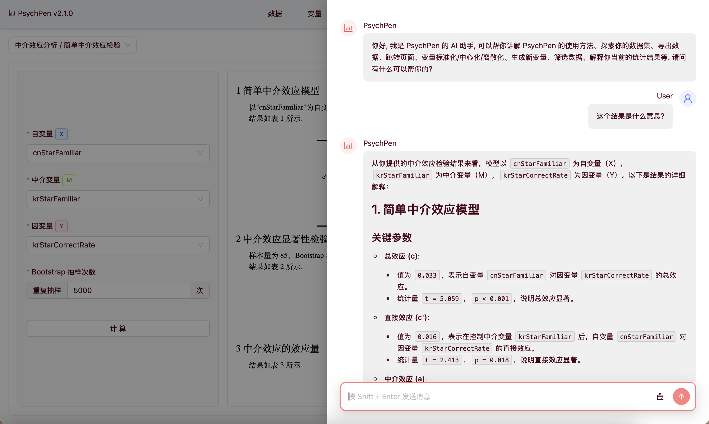 | 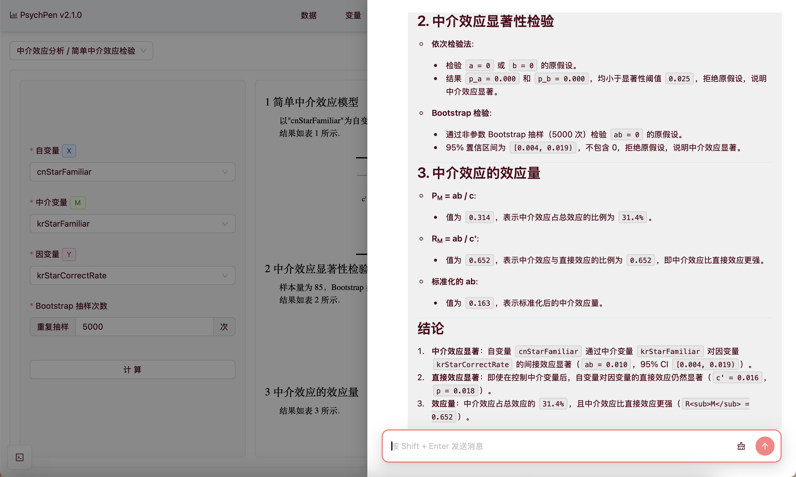 |
| :---------------------: | :---------------------: |

## 3 变量视图

变量视图包含了一系列变量处理相关的功能

> 注: 变量处理的内部顺序是: `定义缺失值` -> `缺失值插值` -> `标准化/中心化/离散化` -> `描述统计` -> `数据筛选` -> `计算变量`; 变量视图所展示的信息、生成新变量所用统计量为数据筛选**前**的信息, 数据视图、统计视图、绘图视图所用的是数据筛选**后**的数据

### 3.1 变量预览

在变量表格中, 你可以查看你导入的数据表格中的变量信息. 包括变量名、类型 (决定了能否用该变量进行一些数学运算)、缺失值情况、描述统计信息 (如均值、标准差、最大值、最小值) 等

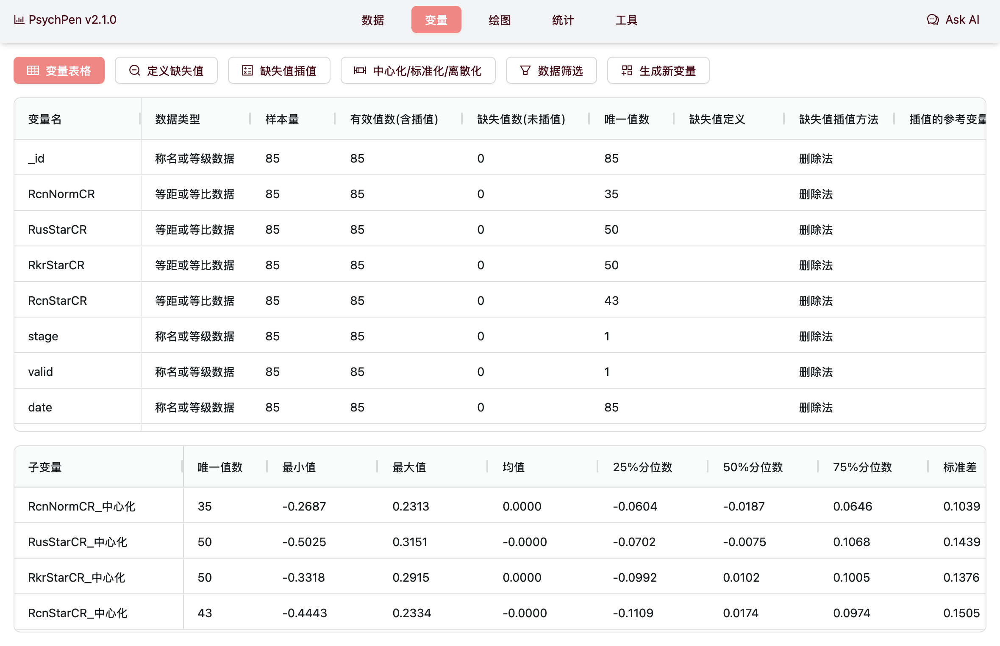

> 注: PsychPen 延用 PsychLib 的计算众数的方式: 如果有多个众数, 则显示皮尔逊经验公式计算的众数 (中位数 x 3 - 均值 x 2)

### 3.2 定义缺失值

通常, 在研究数据中不会直接将缺失值留空, 而是将缺失值标注为特定的值, 以便于后续的数据处理 (例如用 `-1`、`-99`、`99` 等值表示缺失值). 在变量视图中, 你可以点击 `定义缺失值` 按钮, 在此页面定义这些缺失值, 以便将它们删除或插值

在 `定义缺失值` 页面, 你可以选择变量 (可多选或直接选择 `全部变量`), 输入缺失值的值 (如果要取消定义缺失值, 可以将输入框留空), 点击 `确认` 按钮即可定义缺失值. 设置缺失值后, 你可以在 `变量表格` 中看到定义的缺失值的情况


### 3.3 缺失值插值

研究中可能会因为各种原因导致数据缺失, 如果样本量较大, 直接删除缺失值是一个不错的选择; 但当实验样本比较珍贵, 或直接删除缺失值会带来误差时, 研究者往往会选择合适的插值法来将缺失值替换为有效值. 在变量视图中, 你可以点击 `缺失值插值` 按钮, 在此页面选择合适的插值方法, 以便将缺失值替换为有效值

在 `缺失值插值` 页面, 你可以选择变量 (可多选), 选择插值方法 (均值、中位数、最临近点插值、拉格朗日插值), 如果使用了后两种插值方法, 还需要选择插值参考的变量. 选择好插值方法后, 点击 `确认` 按钮即可进行插值. 插值处理后, 你可以在 `变量表格` 中看到插值的设置情况


### 3.4 中心化/标准化/离散化

在数据分析中, 有时需要对原始数据进行处理. 标准化是指把 `x` 转换为 `(x - μ) / σ`, 从而让数据的均值为 `0`, 方差为 `1`; 中心化是指把 `x` 转换为 `x - μ`, 从而让数据的均值为 `0`, 方差不变; 两种处理均不会改变数据的分布形状. 离散化是指把连续变量通过某种规则转换为离散变量, 以便于分组分析

在变量视图中, 你可以点击 `中心化/标准化化/离散化` 按钮, 在此页面选择变量 (可多选), 并选择一个或多个子变量; 如果选择了离散化, 你还需要选择离散化的方法 (等宽、等频、聚类分析 `k-means`) 和离散化的区间数. 生成子变量后, 你可以在 `变量表格` 和 `数据` 视图中看到生成的子变量

> 注: 生成的子变量名为 `xxx_标准化`、`xxx_中心化`、`xxx_等宽离散`、`xxx_等频离散`、`xxx_聚类分析离散`, 其中 `xxx` 为原变量名

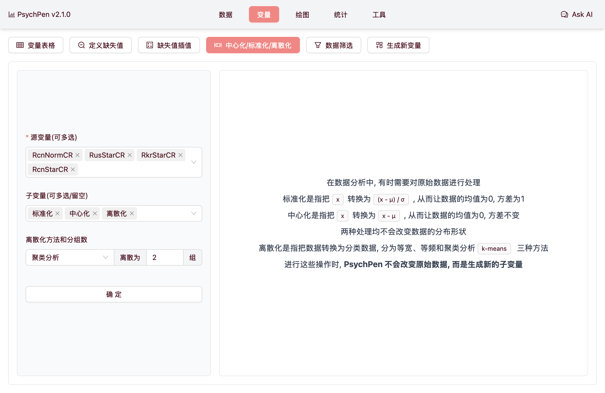

### 3.5 数据筛选

数据筛选可以让你根据自己的需求, 选择性地使用满足过滤规则的数据来进行统计分析和数据可视化. 在变量视图中, 你可以点击 `数据筛选` 按钮, 在此页面输入过滤表达式 (见 [3.7 表达式语法](#37-表达式语法)), 点击 `确认` 按钮即可生成新数据. 生成后, 你可以在 `数据视图` 中看到过滤后的数据 (而变量视图中的变量描述统计信息仍是过滤前数据的信息)

> 注意: 如果筛选所用的表达式中的任意变量为缺失值, 则该行数据会被自动过滤; 如果需要保留该行数据, 请提前进行缺失值插值


### 3.6 生成新变量

在心理学和教育学研究中, 通常需要对原始数据进行一些计算, 以得到最终用于分析的变量. 在变量视图中, 你可以点击 `生成新变量` 按钮, 在此页面输入计算表达式 (见 [3.7 表达式语法](#37-表达式语法)) 和新变量名, 点击 `计算` 按钮并确认即可生成新变量. 生成后, 你可以在 `变量表格` 和 `数据视图` 中看到生成的新变量

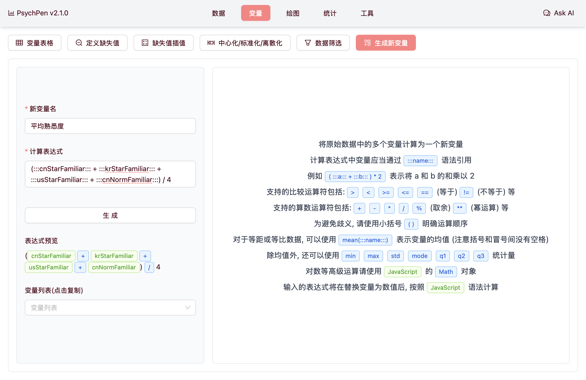

### 3.7 表达式语法

在计算变量和数据筛选中, 你可以使用 PsychPen 内置的表达式语法来生成新变量或进行筛选数据. 表达式中, 你可以使用 `:::变量名:::` 来引用其他变量的值, 并通过 `+` `-` `*` `/` 等运算符进行计算、通过 `>` `<` `>=` `<=` 等运算符进行判断. 下面是一些常见的表达式语法示例:

- 在**计算变量**中, 给数个题目的分数求均值: `( :::题目1::: + :::题目2::: + :::题目3::: + :::题目4::: + :::题目5::: ) / 5`
- 在**计算变量**中, 处理反向计分的题目: `( :::题目1::: + ( 6 - :::题目2::: ) + :::题目3::: + ( 6 - :::题目4::: ) + :::题目5::: ) / 5`
- 在**计算变量**中, 计算开方、平方、绝对值: `( :::题目1::: ** 2 ) + ( Math.sqrt( :::题目2::: ) ) + ( Math.abs( :::题目3::: - :::题目4::: ) )`
- 在**计算变量**中, 手动进行变量标准化: `( :::题目1::: - mean(:::题目1:::) ) / std(:::题目1:::)` (仅为演示, 实际使用时推荐直接使用标准化/中心化/离散化功能)
- 在**计算变量**中, 将高/低分数标记为 `高` / `低`: `:::分数::: >= mean(:::分数:::) ? '高' : '低'`
- 在**数据筛选**中, 筛选出变量 `a` 大于变量 `b` 的数据: `:::a::: > :::b:::`
- 在**数据筛选**中, 筛选出变量 `a` 大于均值的数据: `:::a::: > mean(:::a:::)`
- 在**数据筛选**中, 筛选出变量 `a` 大于均值且小于中位数的数据: `( :::a::: > mean(:::a:::) ) && ( :::a::: < q2(:::a:::) )`

> 实际上, PsychPen 的表达式语法在将变量替换为其数值后, 就是一个 `JavaScript` 表达式, 所以你可以使用 `JavaScript` 的数学函数和逻辑运算符来进行计算和判断

#### 3.7.1 变量相关语法

|         符号         |                                                 含义                                                  |
| :------------------: | :---------------------------------------------------------------------------------------------------: |
|    `:::变量名:::`    |                            引用其他变量的值, 会在计算时替换为指定变量的值                             |
| `min(:::变量名:::)`  |         引用变量的最小值, **只适用于等距或等比数据**, 注意: 小括号和 `:::` 之间**不要**有空格         |
| `max(:::变量名:::)`  |         引用变量的最大值, **只适用于等距或等比数据**, 注意: 小括号和 `:::` 之间**不要**有空格         |
| `mean(:::变量名:::)` |          引用变量的均值, **只适用于等距或等比数据**, 注意: 小括号和 `:::` 之间**不要**有空格          |
| `mode(:::变量名:::)` |          引用变量的众数, **只适用于等距或等比数据**, 注意: 小括号和 `:::` 之间**不要**有空格          |
|  `q1(:::变量名:::)`  |     引用变量的 `25%` 分位数, **只适用于等距或等比数据**, 注意: 小括号和 `:::` 之间**不要**有空格      |
|  `q2(:::变量名:::)`  | 引用变量的 `50%` 分位数 (中位数), **只适用于等距或等比数据**, 注意: 小括号和 `:::` 之间**不要**有空格 |
|  `q3(:::变量名:::)`  |     引用变量的 `75%` 分位数, **只适用于等距或等比数据**, 注意: 小括号和 `:::` 之间**不要**有空格      |
| `std(:::变量名:::)`  |         引用变量的标准差, **只适用于等距或等比数据**, 注意: 小括号和 `:::` 之间**不要**有空格         |

#### 3.7.2 计算相关语法

|     符号      |                                         含义                                          |
| :-----------: | :-----------------------------------------------------------------------------------: |
|     `()`      |          小括号, 用于明确运算顺序; 注意: 没有中括号和大括号, 请都使用小括号           |
|      `+`      |                                    同数学中的加号                                     |
|      `-`      |                                    同数学中的减号                                     |
|      `*`      |                                    同数学中的乘号                                     |
|      `/`      |                                    同数学中的除号                                     |
|     `**`      |                                    同数学中的乘方                                     |
|      `%`      |                                        取余数                                         |
| `Math.abs()`  | 同数学中的绝对值, 如 `Math.abs( :::a::: - :::b::: )` 表示变量 `a` 和 `b` 的差的绝对值 |
| `Math.sqrt()` |           同数学中的平方根, 如 `Math.sqrt( :::a::: )` 表示变量 `a` 的平方根           |

> 更多数学函数请参考 [MDN Web Docs](https://developer.mozilla.org/zh-CN/docs/Web/JavaScript/Reference/Global_Objects/Math)

#### 3.7.3 判断相关语法

|  符号  |                                 含义                                 |
| :----: | :------------------------------------------------------------------: |
|  `()`  |  小括号, 用于明确运算顺序; 注意: 没有中括号和大括号, 请都使用小括号  |
|  `>`   |                     大于, 如 `:::a::: > :::b:::`                     |
|  `<`   |                     小于, 如 `:::a::: < :::b:::`                     |
|  `>=`  |                  大于等于, 如 `:::a::: >= :::b:::`                   |
|  `<=`  |                  小于等于, 如 `:::a::: <= :::b:::`                   |
|  `==`  |                    等于, 如 `:::a::: == :::b:::`                     |
|  `!=`  |                   不等于, 如 `:::a::: != :::b:::`                    |
|  `&&`  |   逻辑与 (且), 如 `( :::a::: > :::b::: ) && ( :::a::: < :::c::: )`   |
| `\|\|` |  逻辑或 (或), 如 `( :::a::: > :::b::: ) \|\| ( :::a::: < :::c::: )`  |
|  `!`   | 逻辑非 (非), 如 `!( :::a::: > :::b::: )` 相当于 `:::a::: <= :::b:::` |
| `? :`  |     三元运算符, 如 `:::a::: > :::b::: ? 'a大于b' : 'a小于等于b'`     |

> 注意: 如果您熟悉 `JavaScript`, 您可能会想使用 `===` 和 `!==`, 但为了避免一些潜在的问题, 我们建议您使用 `==` 和 `!=`

## 4 绘图视图

在绘图视图中, 你可以在页面左上角选择你要绘制的图表类型, 进入对应的图表绘制页面

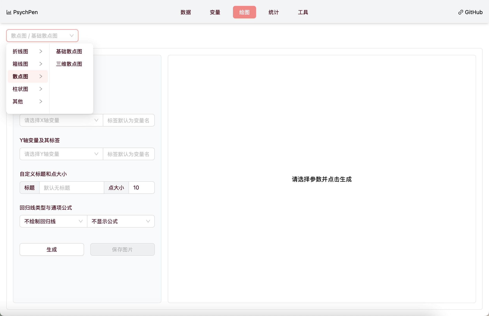

### 4.1 折线图

#### 4.1.1 基础折线图

在基础折线图页面中, 你可以选择你要进行绘图的变量的类型 (被试内变量/被试间变量). 如果是被试内变量, 你需要选择你要进行绘图的变量 (即X轴上的不同值); 如果是被试间变量, 你需要选择你要进行检验的数据变量 (Y轴数据) 和分组变量 (X轴上的不同值). 点击 `生成` 按钮即可生成图片, 生成后, 点击 `保存图片` 按钮可以保存图片

此外, 你还可以自定义 X 轴和 Y 轴的标签、选择折线图显示的统计量、是否启用折线平滑、是否显示数据标签

|       被试内变量       |       被试间变量       |
| :--------------------: | :--------------------: |
| 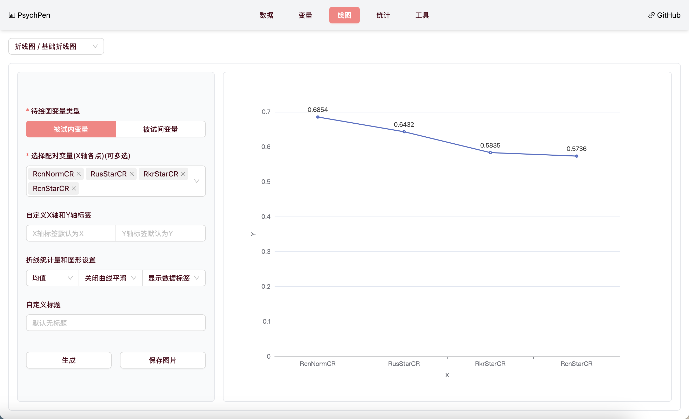 | 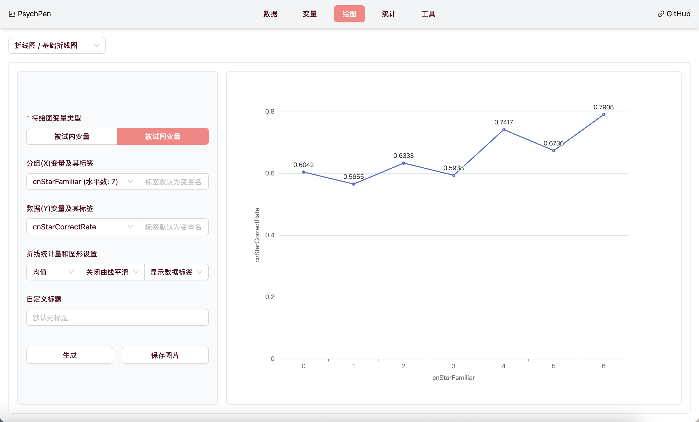 |

#### 4.1.2 平行折线图

在平行折线图页面中, 你可以选择你要进行绘图的变量, 每个选择的变量都是 X 轴上的一条竖线. 每个数据都会成为连接这些竖线的一条横向折线. 点击 `生成` 按钮即可生成图片, 生成后, 点击 `保存图片` 按钮可以保存图片

此外, 你还可以自定义每个变量的标签、折线的宽度和颜色

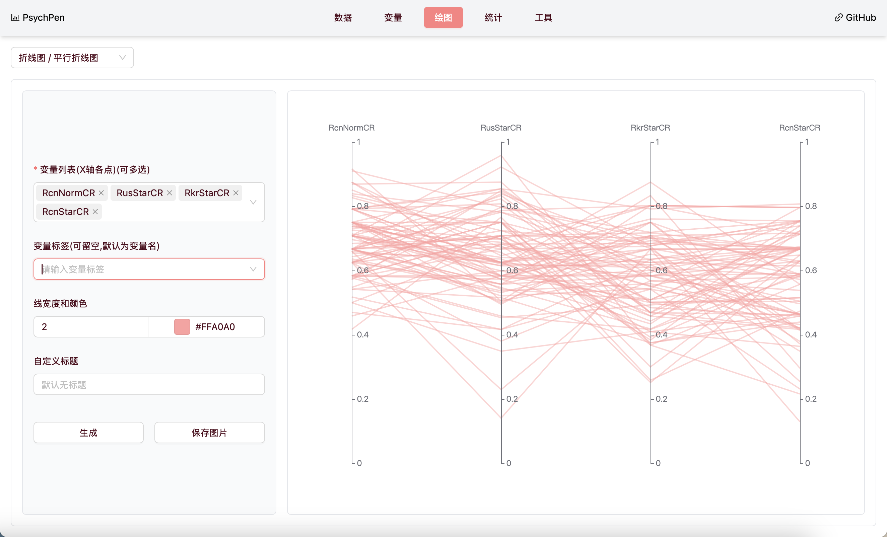

#### 4.1.3 堆叠折线图

在堆叠折线图页面中, 你可以选择你要进行绘图的变量的类型 (被试内变量/被试间变量). 如果是被试内变量, 你需要选择你要进行绘图的变量 (即X轴上的不同值); 如果是被试间变量, 你需要选择你要进行检验的数据变量 (Y轴数据) 和分组变量 (X轴上的不同值). 再选择一个变量作为堆叠变量, 以它的不同取值来区分不同的折线. 点击 `生成` 按钮即可生成图片, 生成后, 点击 `保存图片` 按钮可以保存图片

此外, 你还可以自定义 X 轴和 Y 轴的标签、选择折线图显示的统计量、是否启用折线平滑、是否显示数据标签

|       被试内变量       |       被试间变量       |
| :--------------------: | :--------------------: |
| 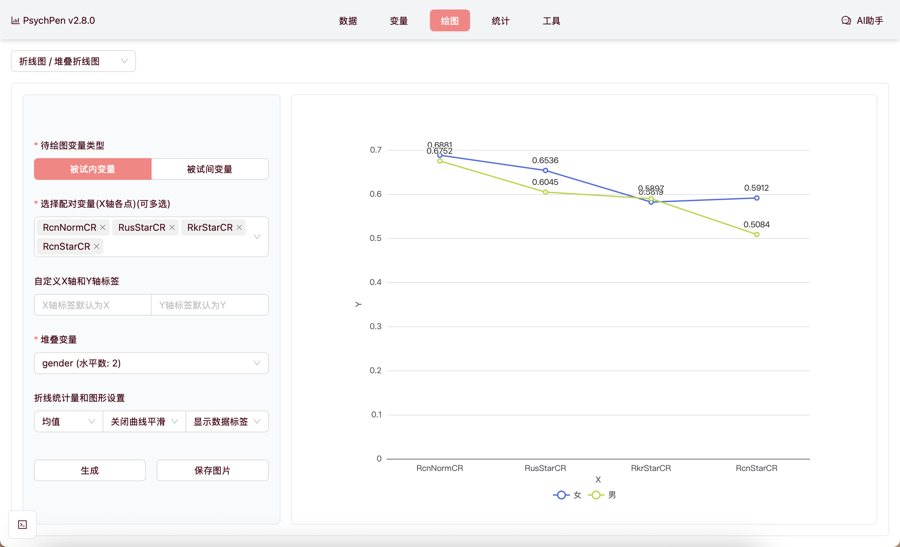 | 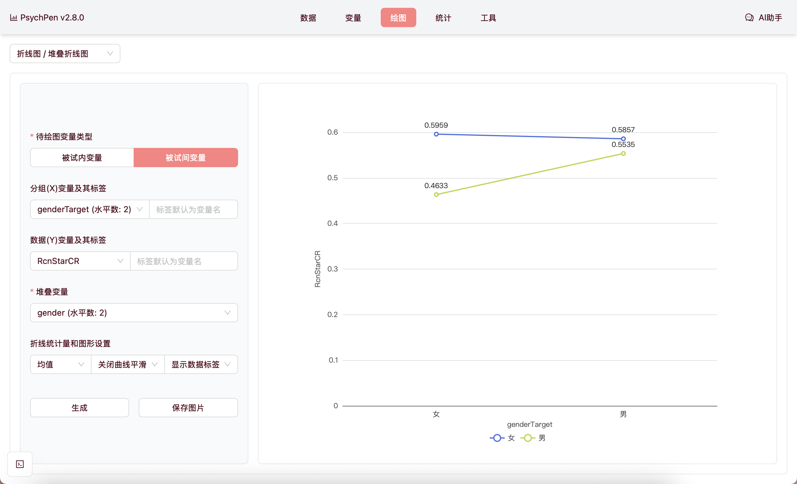 |

### 4.2 散点图

#### 4.2.1 基础散点图

在基础散点图页面中, 你可以选择你要进行绘图 X 轴和 Y 轴的变量. 点击 `生成` 按钮即可生成图片, 生成后, 点击 `保存图片` 按钮可以保存图片

此外, 你还可以自定义 X 轴和 Y 轴的标签、自定义散点大小、绘制回归线、显示回归方程

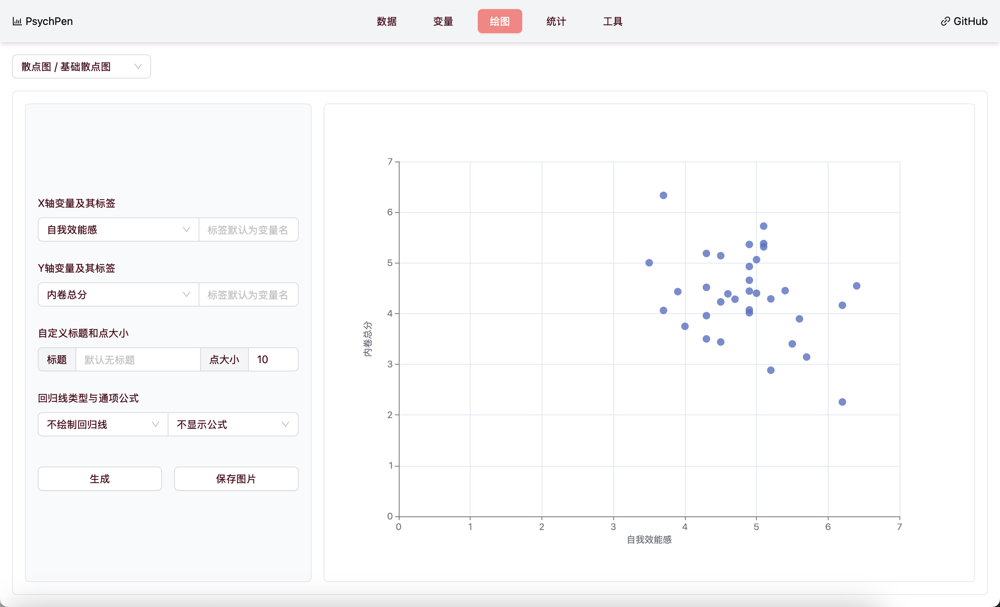

#### 4.2.2 三维散点图

在三维散点图页面中, 你可以选择你要进行绘图的 X 轴、Y 轴和 Z 轴的变量. 点击 `生成` 按钮即可生成图片, 生成后, 点击 `保存图片` 按钮可以保存图片

此外, 你还可以自定义 X 轴、Y 轴和 Z 轴的标签

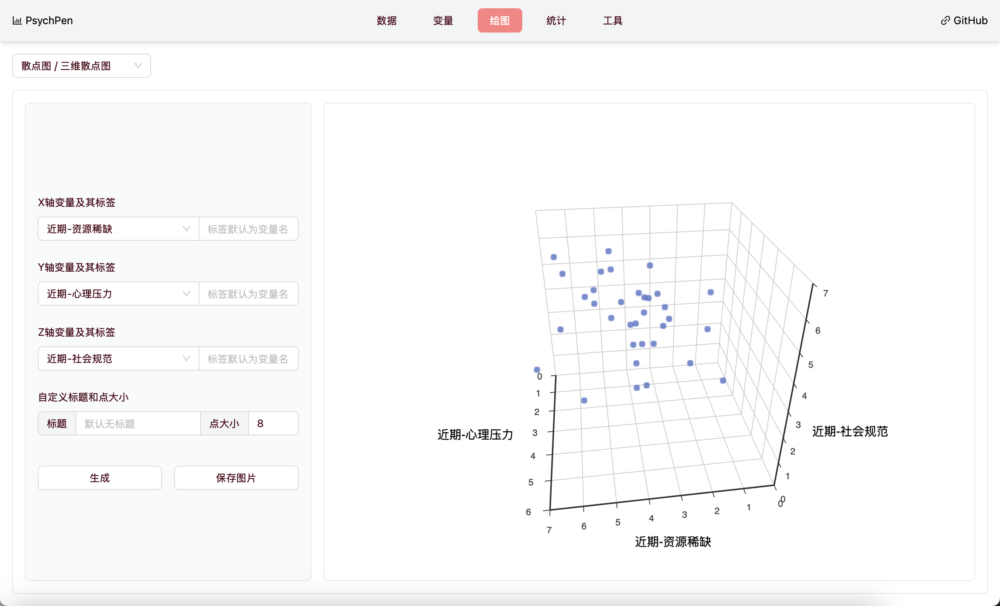

### 4.3 直方图/柱状图

#### 4.3.1 基础柱状图

在基础柱状图页面中, 你可以选择你要进行绘图的变量的类型 (被试内变量/被试间变量). 如果是被试内变量, 你需要选择你要进行绘图的变量; 如果是被试间变量, 你需要选择你要进行检验的数据变量 (Y轴数据) 和分组变量 (X轴上的不同值). 点击 `生成` 按钮即可生成图片, 生成后, 点击 `保存图片` 按钮可以保存图片

此外, 你还可以自定义 X 轴和 Y 轴的标签、是否显示误差棒、误差棒的内容、是否显示数据标签

|       被试内变量       |       被试间变量        |
| :--------------------: | :---------------------: |
| 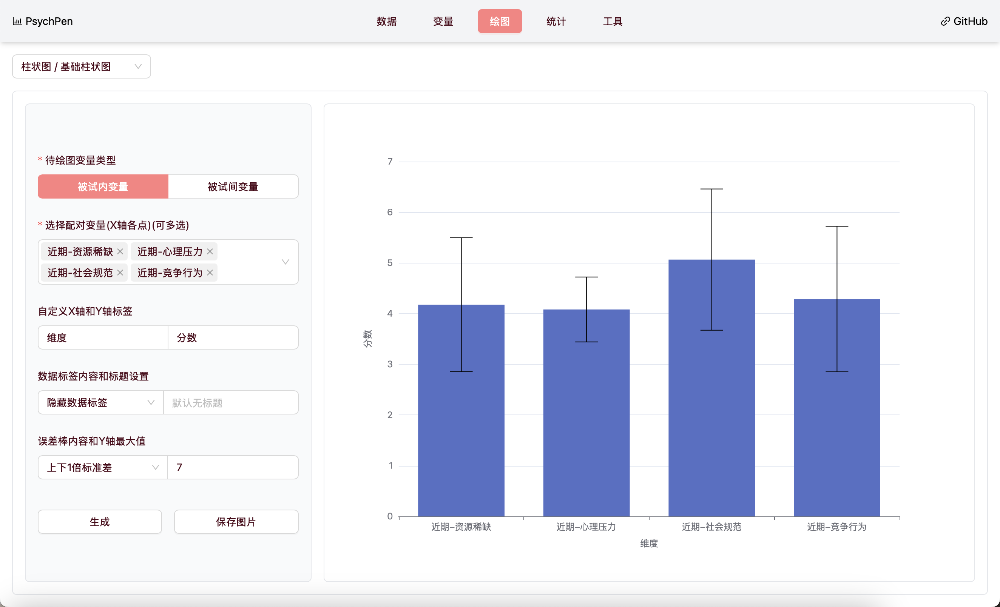 | 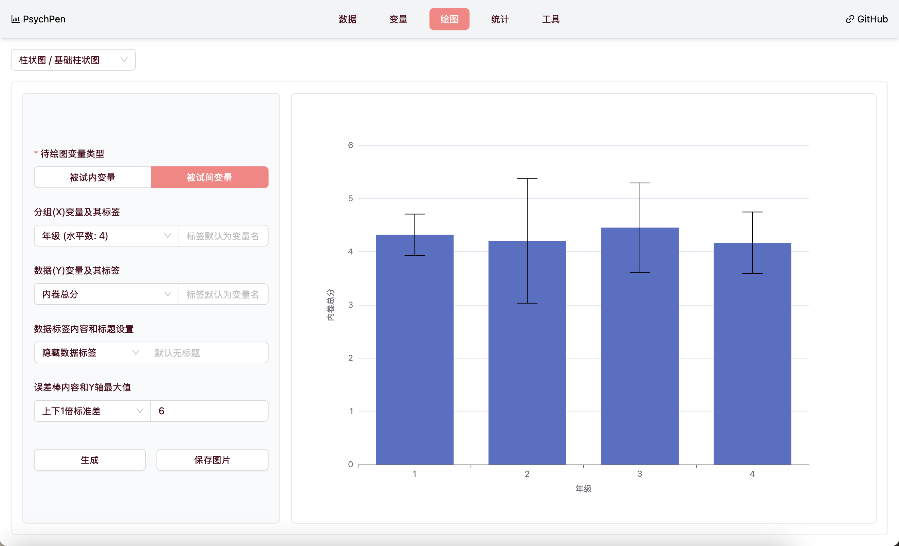 |

#### 4.3.2 三维柱状图

在三维柱状图页面中, 你可以选择你要进行绘图的 X 轴、Y 轴和 Z 轴的变量. 点击 `生成` 按钮即可生成图片, 生成后, 点击 `保存图片` 按钮可以保存图片

此外, 你还可以自定义 X 轴、Y 轴和 Z 轴的标签、柱状图的统计量

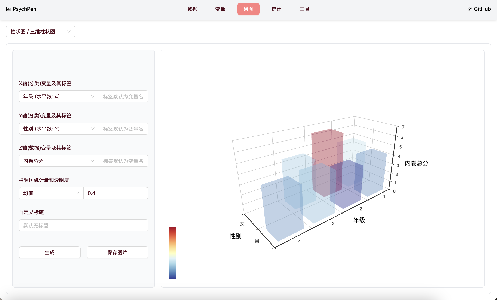

#### 4.3.3 分组柱状图

在分组柱状图页面中, 你可以选择你要进行绘图的分组变量 (X轴上的不同值) 和数据变量 (每个X轴上的值需要显示的Y轴数据). 点击 `生成` 按钮即可生成图片, 生成后, 点击 `保存图片` 按钮可以保存图片

此外, 你还可以自定义 X 轴和 Y 轴的标签、分组变量每一组的标签、数据变量每一项的标签、误差棒的内容等

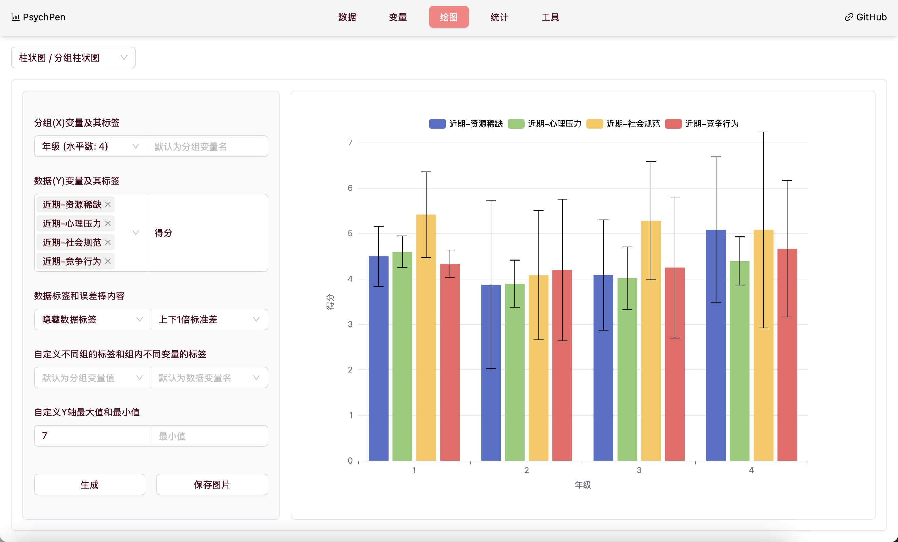

### 4.4 箱线图

#### 4.4.1 基础箱线图

在基础箱线图页面中, 你可以选择你要进行绘图的变量的类型 (被试内变量/被试间变量). 如果是被试内变量, 你需要选择你要进行绘图的变量; 如果是被试间变量, 你需要选择你要进行检验的数据变量 (Y轴数据) 和分组变量 (X轴上的不同值). 点击 `生成` 按钮即可生成图片, 生成后, 点击 `保存图片` 按钮可以保存图片

此外, 你还可以自定义 X 轴和 Y 轴的标签

|       被试内变量       |       被试间变量       |
| :--------------------: | :--------------------: |
| 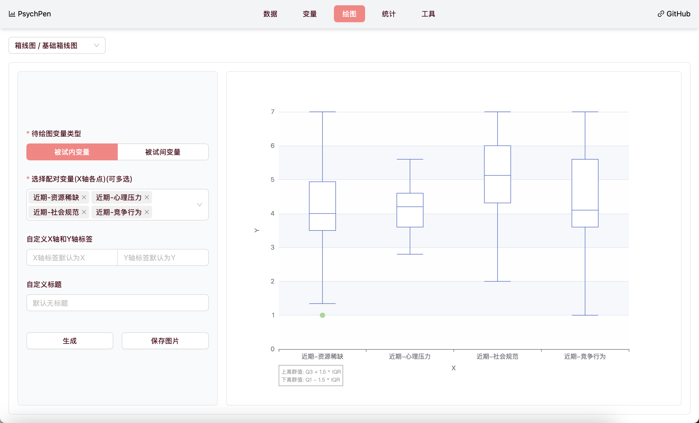 | 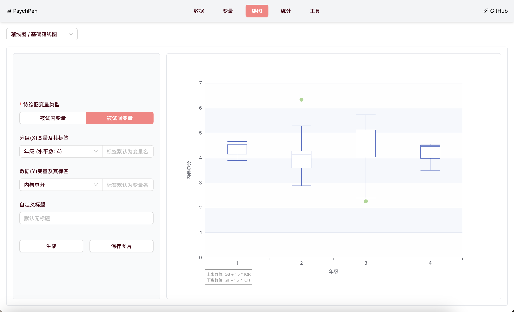 |

### 4.5 饼图

#### 4.5.1 基础饼图

在基础饼图页面中, 你可以选择你要进行绘图的变量. 点击 `生成` 按钮即可生成图片, 生成后, 点击 `保存图片` 按钮可以保存图片

此外, 你还可以设置是否显示数据标签、数据标签的内容

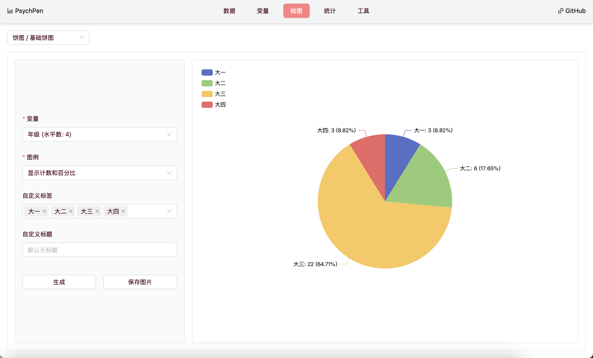

### 4.6 其他

#### 4.6.1 词云图

在词云图页面中, 你可以选择你要进行绘图的变量, 并选择合适的词语过滤规则 (如 `非中文常见字` 会过滤掉除常见中文字外的所有字符), 也可自行输入过滤规则 (字词匹配或正则表达式, 如下图所示), 点击 `生成` 按钮即可生成图片, 生成后, 点击 `保存图片` 按钮可以保存图片

此外, 你还可以自定义词云图的颜色、词云图的形状、单词最大和最小尺寸、单词旋转角度、手动关闭词语切分等

注意: 首次生成词云图时, 由于需要加载中文词语切分的模块, 可能速度较慢, 请耐心等待

| 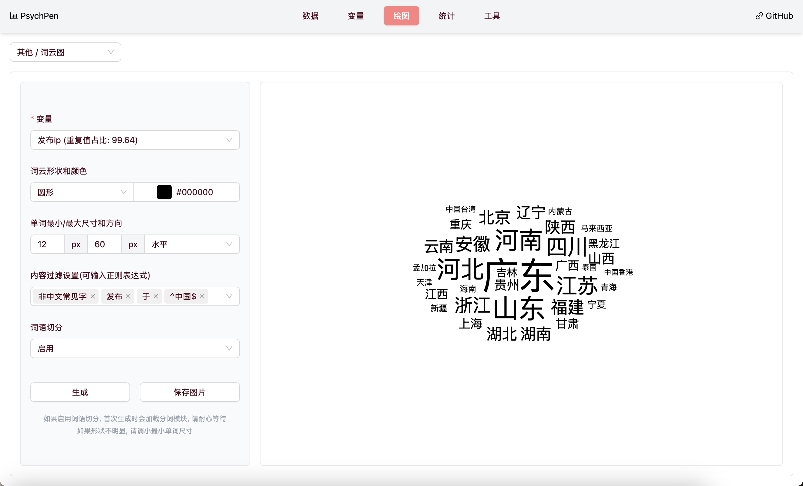 | 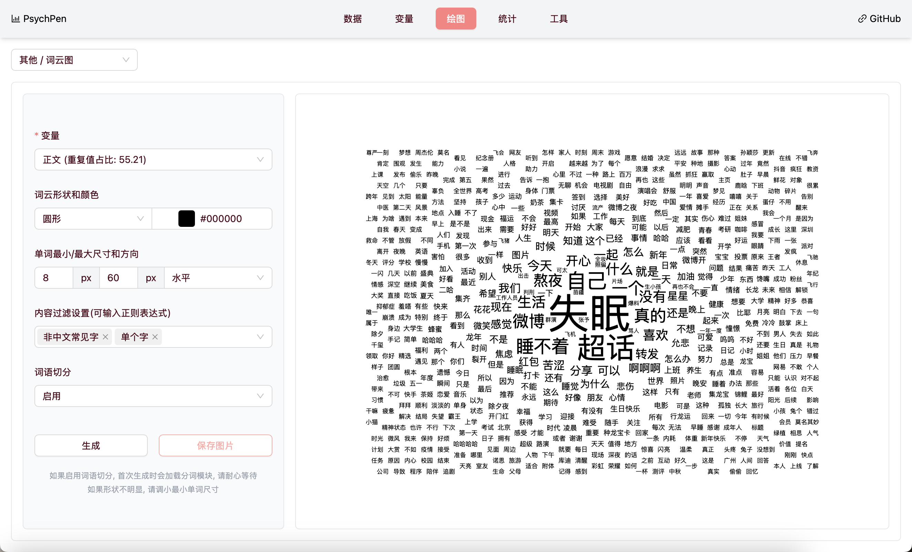 |
| :---------------------: | :---------------------: |

#### 4.6.2 Q-Q 图

在 Q-Q 图 (Quantile-Quantile Plot, 即分位数-分位数图) 页面中, 你可以选择你要进行绘图的变量 (或选择标准正态分布), 点击 `生成` 按钮即可生成图片, 生成后, 点击 `保存图片` 按钮可以保存图片

此外, 你还可以设置是否标准化数据、取点的数量

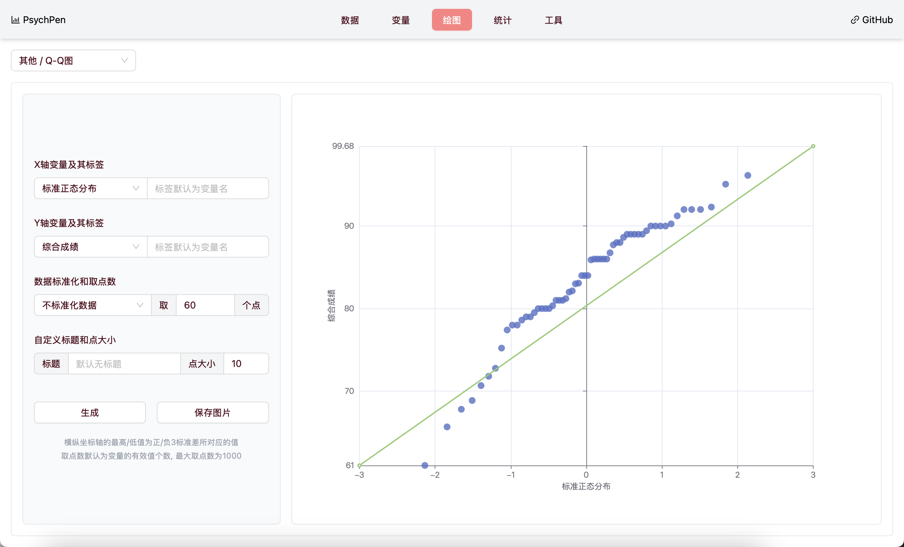

## 5 统计视图

在统计视图中, 你可以在页面左上角选择你要进行的统计检验类型, 进入对应的统计检验页面

> 注: 本应用的所有显著性标注 \* 均表示 P < 0.05, \*\* 表示 P < 0.01, \*\*\* 表示 P < 0.001

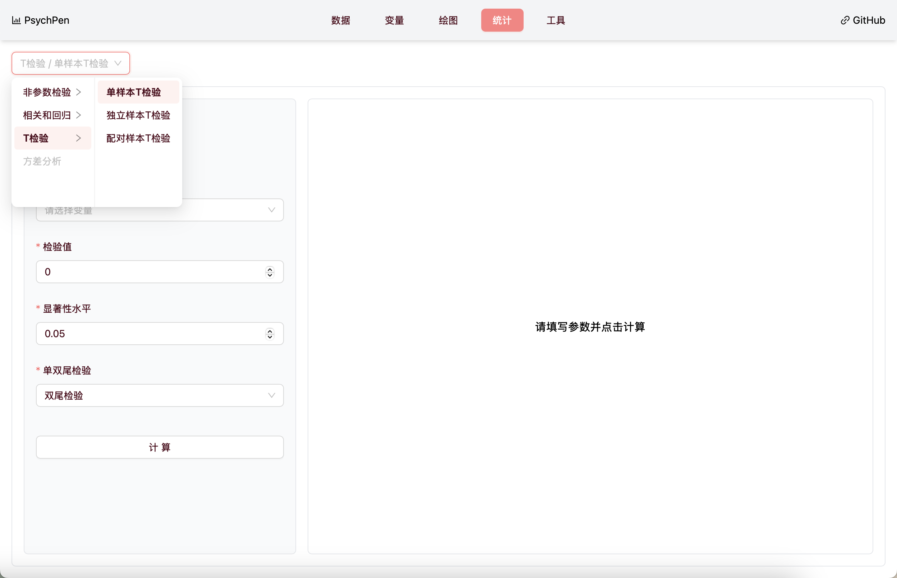

### 5.1 描述统计

在描述统计页面中, 你可以查看你选择的变量的描述性统计信息. 既可以对被试内变量 (一个或多个导入的列) 进行描述统计, 也可以对被试间变量 (一列作为数据, 一列作为分组) 进行描述统计. 描述统计信息包括有效值数、唯一值数、总和、均值、中位数、标准差、方差、Q1(25%分位数)、Q2(50%分位数)、Q3(75%分位数)、众数、最小值、最大值、极差, 可按需选择

|       被试内变量       |       被试间变量       |
| :--------------------: | :--------------------: |
| 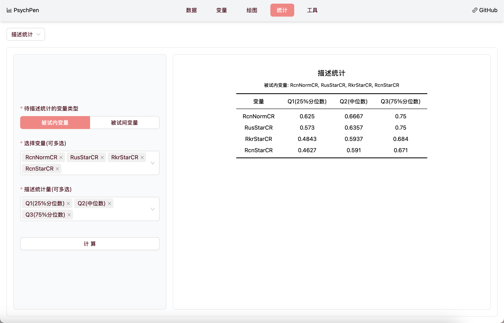 | 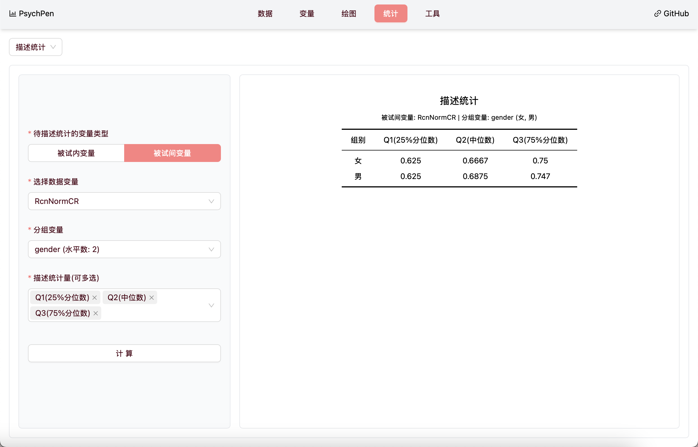 |

### 5.2 t 检验

t 检验是最基础的统计检验之一, 用于检验两组数据 (或一组数据与指定值) 的均值是否有显著差异. 显著差异意味着两组数据的均值差异不是由抽样误差造成的, 而是由总体差异造成的. 结果中给出的 P 值表示"这个差异是由抽样误差造成的"的概率, P 值越小, 说明差异越显著; 通常, P 值小于 0.05 (即差异由抽样误差造成的概率小于 5%) 时, 认为差异显著

t 检验有一些前提假设, 如数据服从正态分布、方差齐性. 在进行 t 检验前, 推荐先使用 Kolmogorov-Smirnov 检验 (检验数据是否服从正态分布) 和 Levene 检验 (检验方差是否齐性), 如果数据符合前提假设, 再进行 t 检验; 否则, 可以考虑使用非参数检验

#### 5.2.1 单样本 t 检验

单样本 t 检验用于检验一组数据的均值是否与指定值有显著差异. 在单样本 t 检验页面中, 你可以选择你要进行检验的变量, 输入你要检验的指定值, 点击 `计算` 按钮即可进行单样本 t 检验. 除此之外, 你还可以自定义检验方向

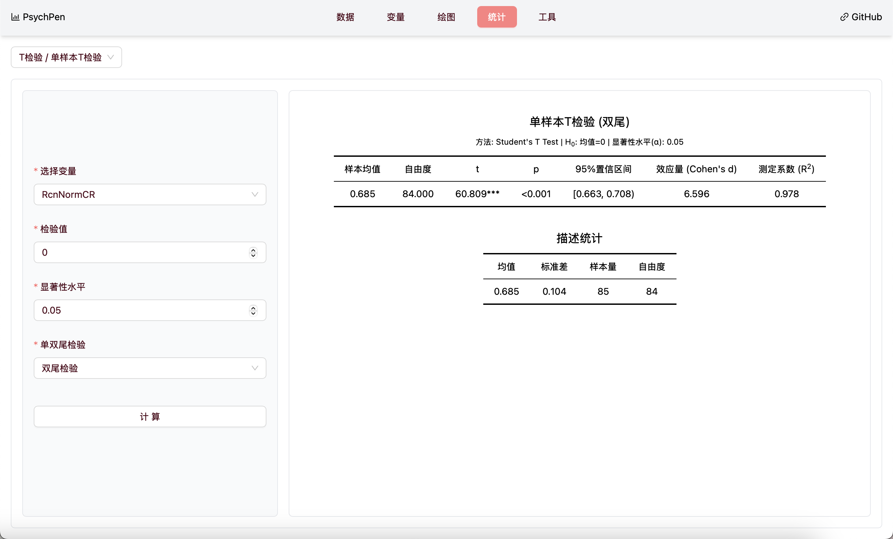

#### 5.2.2 配对样本 t 检验

配对样本 t 检验用于检验两组配对数据 (即同一个被试的两次测量数据) 的均值是否有显著差异. 在配对样本 t 检验页面中, 你可以选择你要进行检验的变量 (共两个), 点击 `计算` 按钮即可进行配对样本 t 检验. 除此之外, 你还可以自定义检验差异值和检验方向

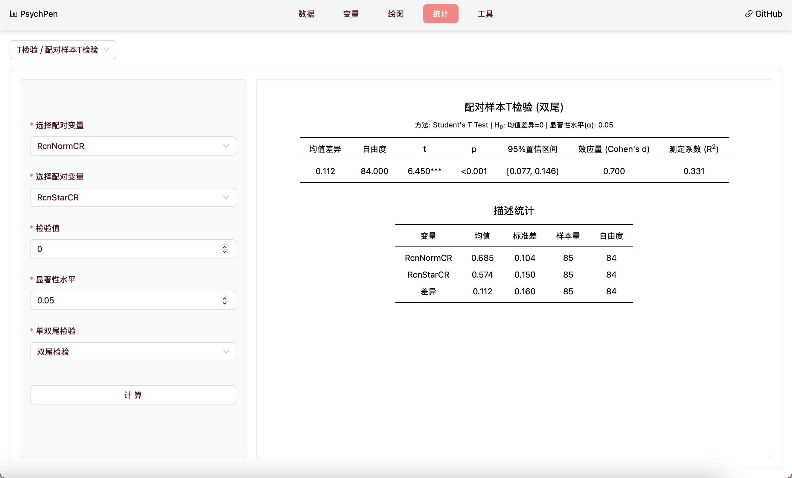

#### 5.2.3 独立样本 t 检验

独立样本 t 检验用于检验两组独立数据 (即两组不同被试的数据) 的均值是否有显著差异. 在独立样本 t 检验页面中, 你可以选择你要进行检验的变量, 再选择用于分组的变量, 点击 `计算` 按钮即可进行独立样本 t 检验. 除此之外, 你还可以自定义检验差异值和检验方向

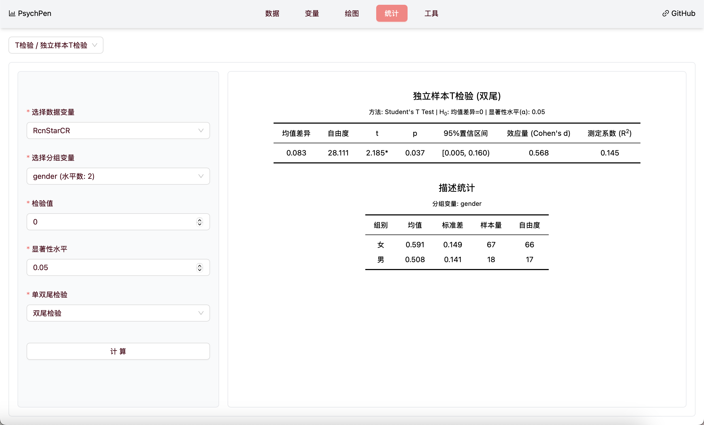

#### 5.2.4 不等方差 t 检验 (Welch's t 检验)

不等方差 t 检验 (Welch's t 检验) 用于检验两组数据的均值是否有显著差异, 不要求两组数据的方差齐性, 且比独立样本 t 检验 (Student's t 检验) 更加稳健. 在不等方差 t 检验页面中, 你可以选择你要进行检验的变量, 再选择用于分组的变量, 点击 `计算` 按钮即可进行不等方差 t 检验. 除此之外, 你还可以自定义检验差异值和检验方向

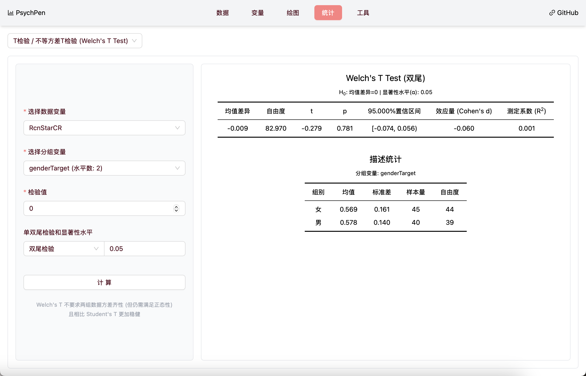

### 5.3 方差分析

#### 5.3.1 单因素方差分析

单因素方差分析用于检验一个有多个水平的被试间自变量, 对一个因变量的影响是否有显著差异. 在单因素方差分析页面中, 你可以选择你要进行检验的数据变量和分组变量, 点击 `计算` 按钮即可进行单因素方差分析. 除此之外, 你还可以选择进行事后检验的方法 (Scheffe、Bonferroni、Tukey)

| 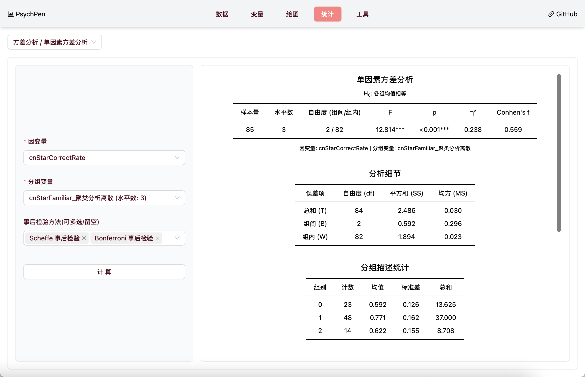 | 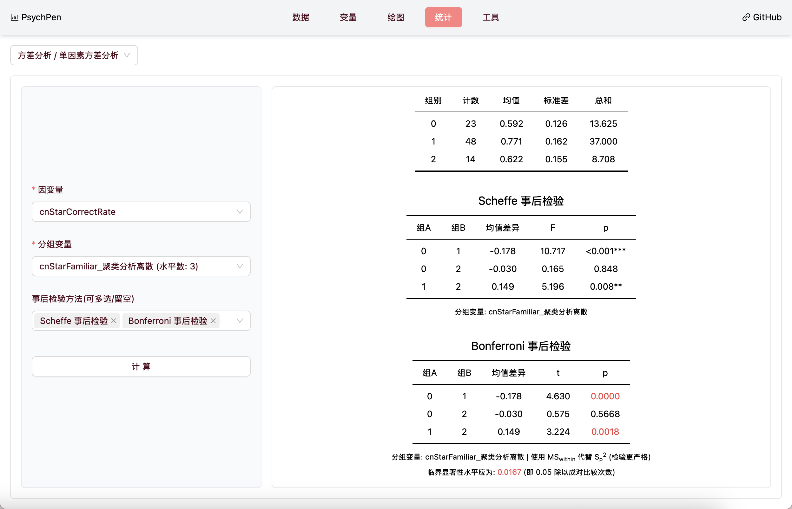 |
| :---------------------: | :---------------------: |

#### 5.3.2 重复测量方差分析

重复测量方差分析用于检验一个有多个水平的被试内自变量, 对一个因变量的影响是否有显著差异. 在重复测量方差分析页面中, 你可以选择你要进行检验的至少2个配对变量, 点击 `计算` 按钮即可进行重复测量方差分析. 除此之外, 你还可以选择进行事后检验的方法 (Scheffe、Bonferroni、Tukey)

| 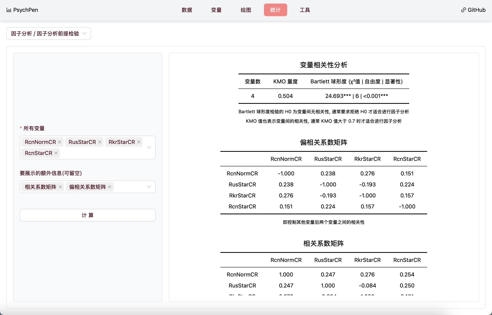 | 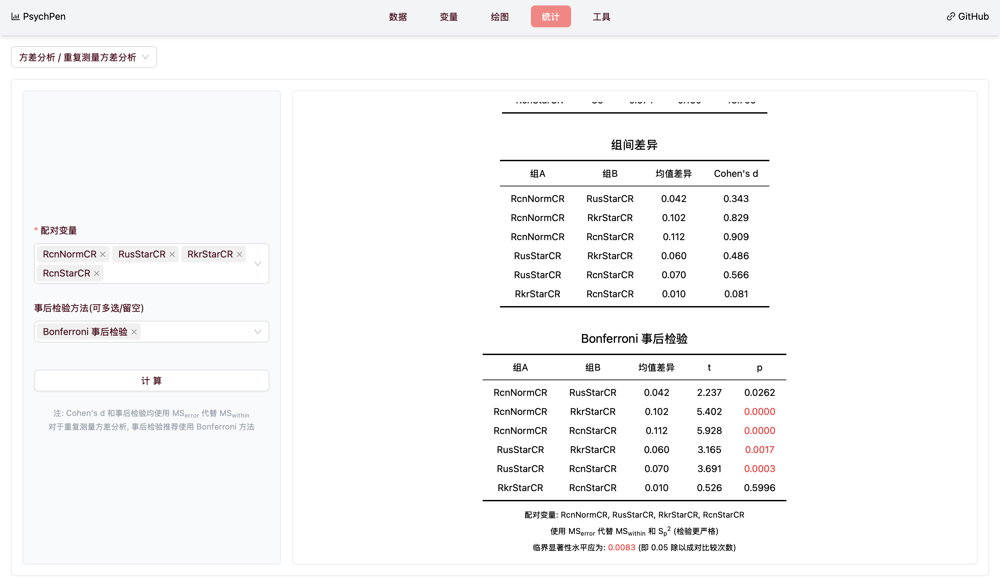 |
| :---------------------: | :---------------------: |

### 5.4 非参数检验

检验均值、中位数等"参数"是否有显著差异的方法称为参数检验; 而检验分布、排序等"非参数"是否有显著差异的方法称为非参数检验. 非参数检验不需要数据满足正态分布和方差齐性等前提假设 (一些非参数检验本身就是对这些假设的检验)

#### 5.4.1 Kolmogorov-Smirnov 检验

Kolmogorov-Smirnov 检验用于检验数据是否服从某个分布 (通常是正态分布). 在 Kolmogorov-Smirnov 检验页面中, 你可以选择你要进行检验的变量 (可以一次选择多个), 点击 `计算` 按钮即可进行 Kolmogorov-Smirnov 检验

注意: 结果的 P 值不显著 (大于 0.05) 时, 才说明数据服从正态分布 (因为检验的原假设是"数据服从XX分布")

|       被试内变量       |       被试间变量        |
| :--------------------: | :---------------------: |
| 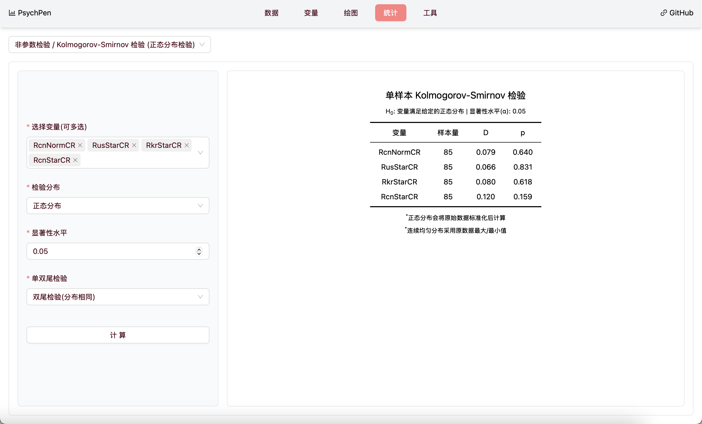 | 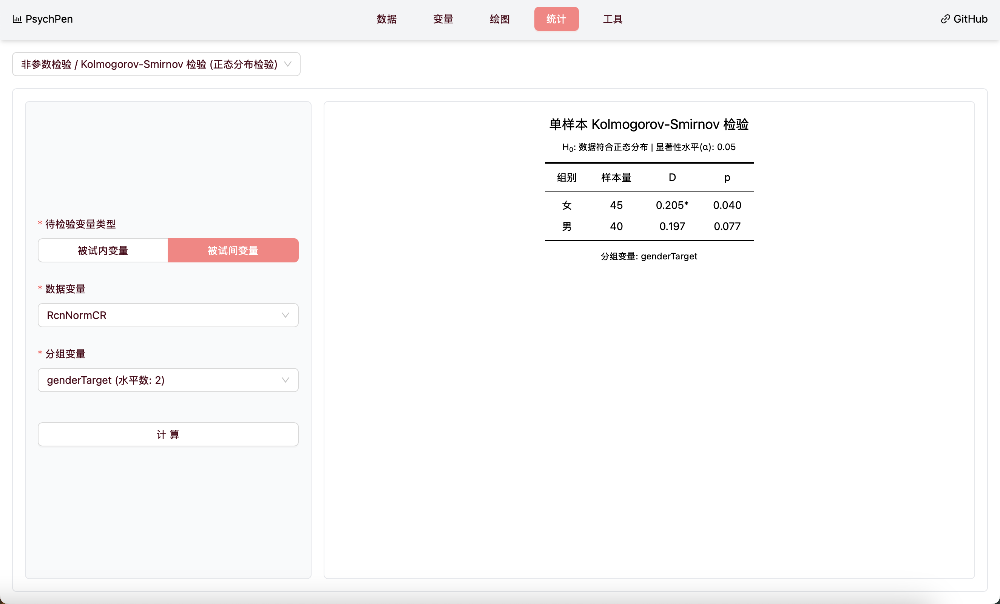 |

需要注意的是，显著性检验在⼩样本中（n<30）由于检验⼒的不⾜，即便是偏态分布也可能⽆法检验出来；但在很⼤的样本中（n>1000）又很敏感，即便有很⼩的峰度或偏度值也会拒绝正态分布的虚⽆假设，但从直⽅图或者正态概率图中直观地看，分布仍然⾮常接近正态分布。因此在检验时需要结合样本量，图形检验，以及峰度或者偏度取值的⼤⼩来综合考虑 (刘红云, 2023)

#### 5.4.2 Levene 检验

Levene 检验用于检验数据是否具有方差齐性. 在 Levene 检验页面中, 你可以选择你要进行检验的变量的类型 (被试内变量/被试间变量). 如果是被试内变量, 你需要选择你要进行检验的变量 (至少选择两个); 如果是被试间变量, 你需要选择你要进行检验的数据变量和分组变量. 点击 `计算` 按钮即可进行 Levene 检验

注意: 结果的 P 值不显著 (大于 0.05) 时, 才说明数据具有方差齐性 (因为检验的原假设是"数据具有方差齐性")

|       被试内变量       |       被试间变量       |
| :--------------------: | :--------------------: |
| 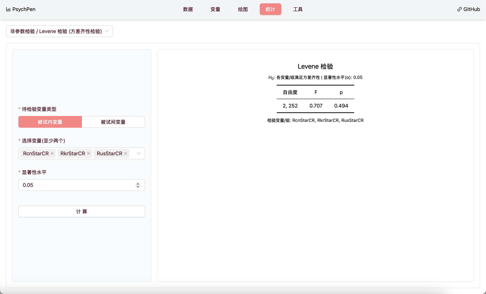 | 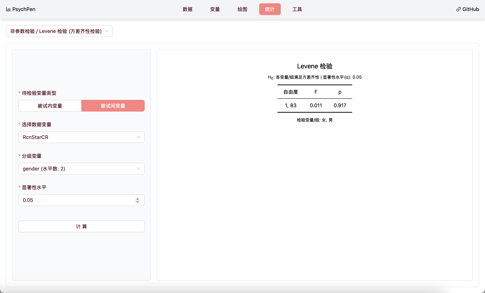 |

#### 5.4.3 峰度和偏度检验

峰度和偏度也是检验数据是否服从正态分布的方法之一. 一般来说, 若计算出的偏度或峰度的绝对值大于 1.96, 则说明分布是非正态的; 若偏度显著大于 0, 则说明分布呈正偏态, 反之, 则说明分布呈负偏态; 若峰度显著大于 0, 则说明分布形态尖而高耸, 若峰度显著小于 0, 则说明分布形态较为扁平. 但在实际应用中, 峰度和偏度值的检验容易受样本量的影响, 即样本量大时特别容易拒绝虚无假设. 因此在经验上, 即使虚无假设被拒绝 (即 P 值的绝对值大于 1.96), 若偏度和峰度绝对值较小, 分布仍可近似为正态的 (刘红云, 2023)

|       被试内变量        |       被试间变量        |
| :---------------------: | :---------------------: |
| 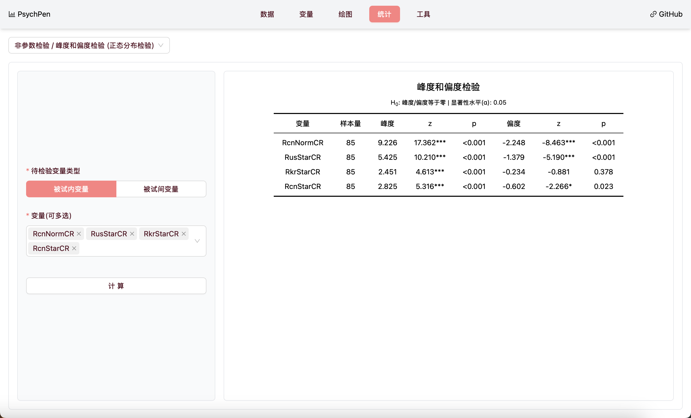 | 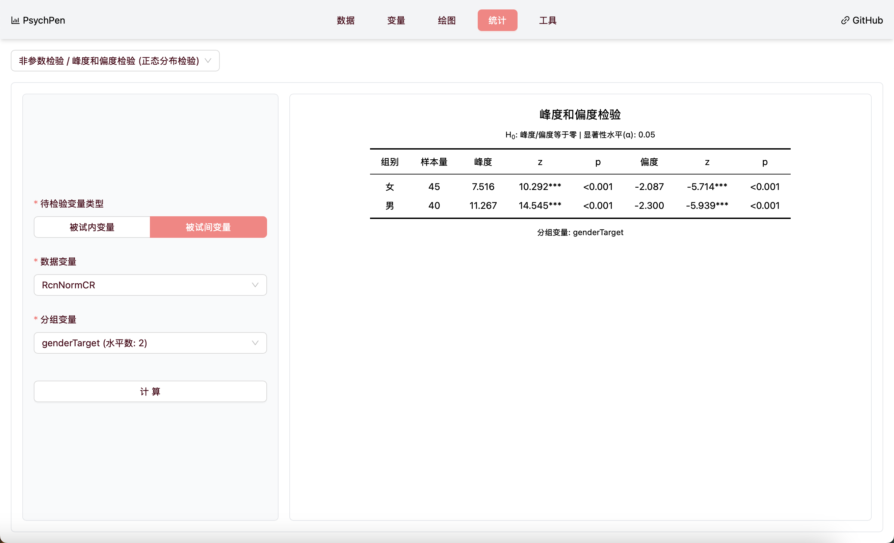 |

### 5.5 相关和回归

#### 5.5.1 Pearson 相关检验

Pearson 相关检验用于检验两组数据之间的线性相关性. 在 Pearson 相关检验页面中, 你可以选择你要进行检验的变量 (至少选择两个), 点击 `计算` 按钮即可进行 Pearson 相关检验. 除此之外, 你还可以自定义检验方向

结果除了会给出你选择的变量两两之间的各种统计量 (如相关系数、显著性水平、置信区间等), 还会给出一个所有变量之间的相关矩阵 (显示相关系数和显著性水平)

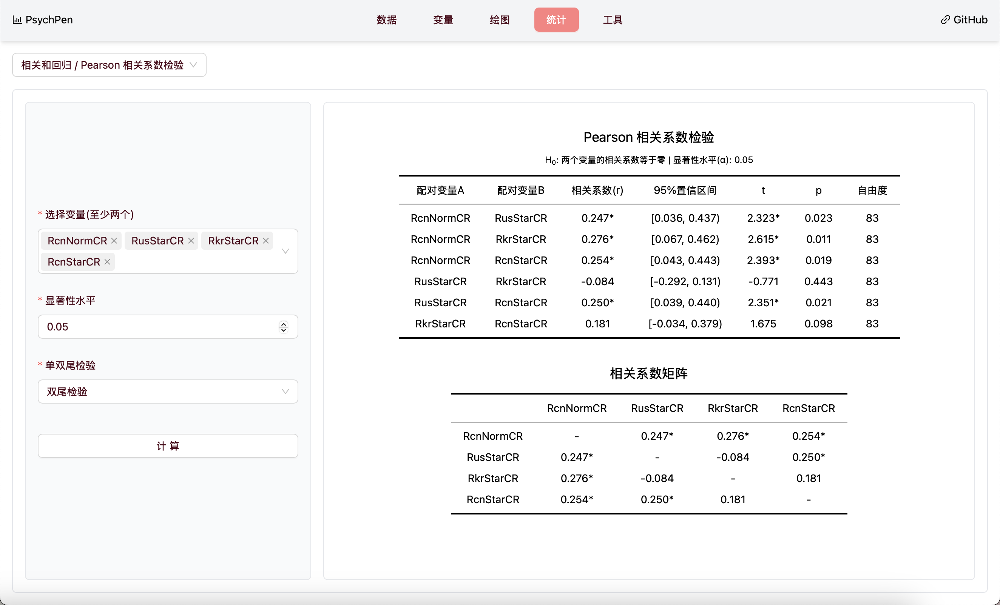

#### 5.5.2 一元线性回归

一元线性回归用于检验一个自变量对一个因变量的影响. 在一元线性回归页面中, 你可以选择你要进行检验的自变量和因变量, 点击 `计算` 按钮即可进行一元线性回归

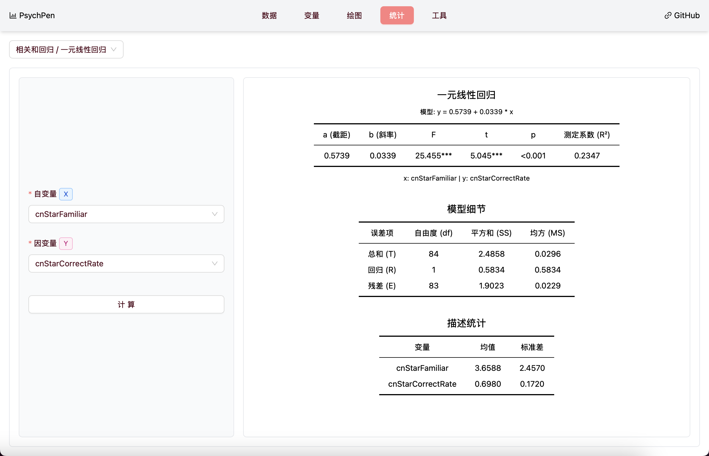

#### 5.5.3 多元线性回归

多元线性回归用于检验多个自变量对一个因变量的影响. 其中:

- **标准多元线性回归**是所有自变量同时进入模型, 共同影响将被排除 (即使用最小二乘法获得偏回归系数); 目的是检验多个自变量对因变量的影响是否显著
- **逐步多元线性回归**是**根据一定标准自动**逐步引入自变量, 以确定哪些自变量对因变量有显著影响 (包括**向前选择**、**向后剔除**、**双向选择**三种方法); 目的是找到最佳的预测模型
- **序列多元线性回归**是**根据研究目的手动**逐步引入自变量, 但不会剔除已经进入模型的自变量, 并将自变量间的共同影响归入先进入模型的自变量中 (从而提高先进入模型的自变量的显著性); 目的是验证新加入的自变量是否对因变量有显著影响

在多元线性回归页面中, 你可以选择你要进行检验的多个自变量和因变量, 并选择回归方法, 点击 `计算` 按钮即可进行多元线性回归

|       标准多元线性回归       |       逐步多元线性回归       |      序列多元线性回归       |
| :-------------------------: | :-------------------------: | :------------------------: |
| 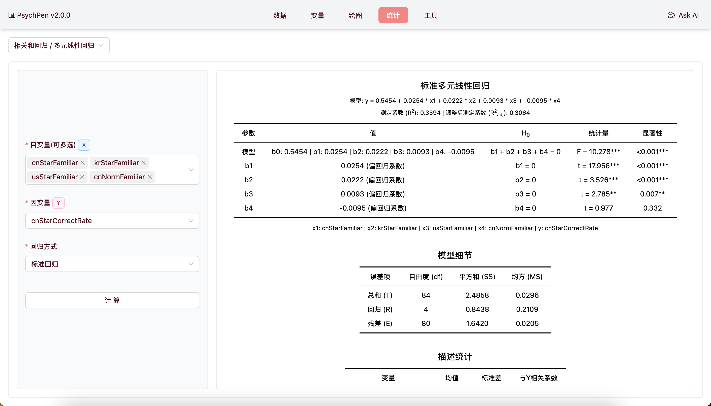 | 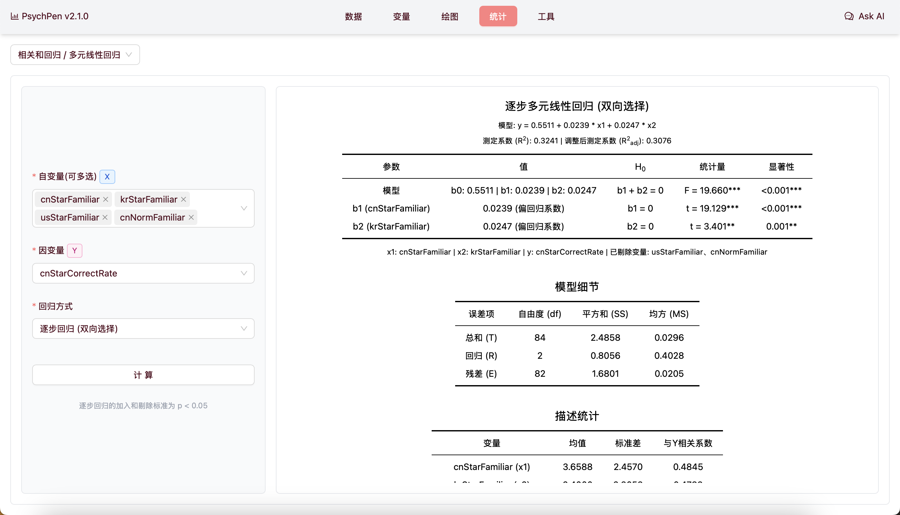 | 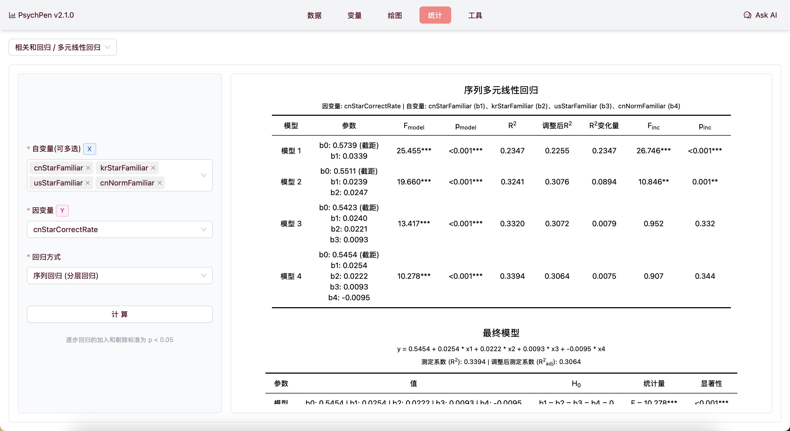 |

### 5.6 信度分析

信度指测量结果的稳定性, 即多次测量能得到一致的结果. 选择的信度测量方法取决于可能的误差来源, 详见[作者的心理测量学笔记](https://blog.leafyee.xyz/2023/11/02/心理测量学/#x2B50-信度)

#### 5.6.1 重测信度/复本信度

重测信度指同一量表, 同一受测群体, 不同时间, 两次施测, 求积差相关; 复本信度指以两个测验复本来测量同一群体, 然后求受测者群体在这两个测验上得分的积差相关. 在本页面中, 你可以选择你要进行检验的变量 (两个), 点击 `计算` 按钮即可进行重测信度/复本信度检验

你还可以选择分组变量, 以便对不同分组的数据进行信度检验

可以接受的信度临界值取决于研究的具体情况, 如下图所示

|       信度临界值        |        使用演示         |
| :---------------------: | :---------------------: |
| 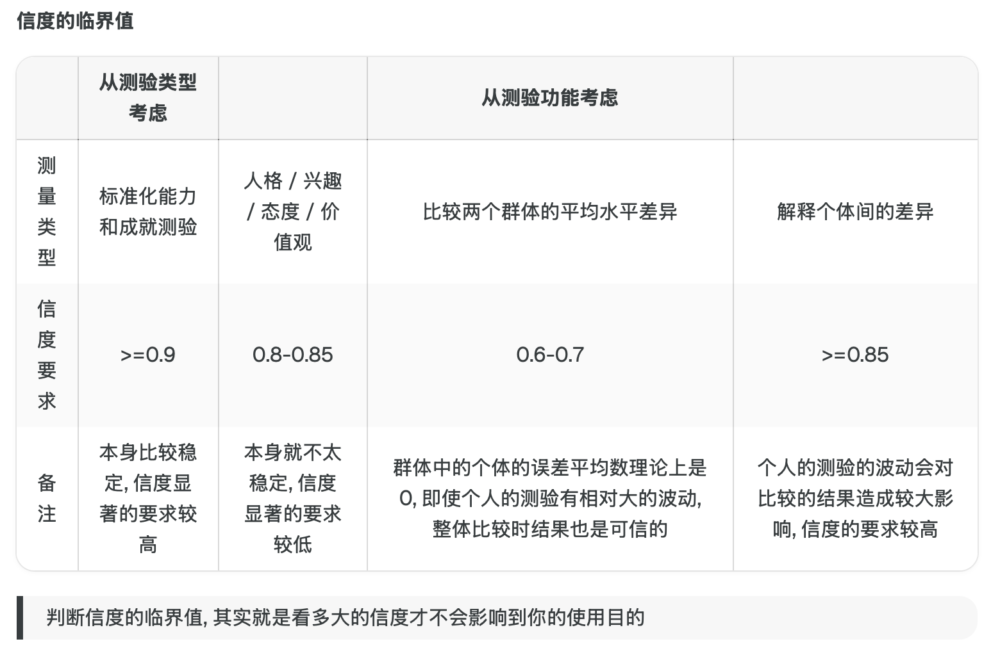 | 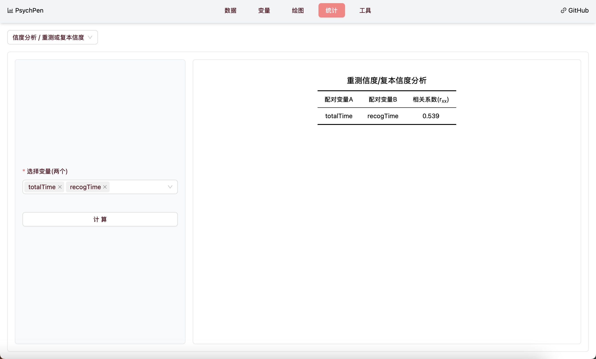 |

#### 5.6.2 分半信度

分半信度指将一个量表分成两半, 每半都包含相同数量的项目, 然后计算两半的得分, 求两半得分的相关系数. 得到的相关系数还需要通过公式修正, 以得到最终的分半信度. 在本页面中, 你可以分别选择两半的变量列表, 点击 `计算` 按钮即可进行分半信度检验

你还可以选择分组变量, 以便对不同分组的数据进行信度检验

|       信度临界值        |        使用演示         |
| :---------------------: | :---------------------: |
|  | 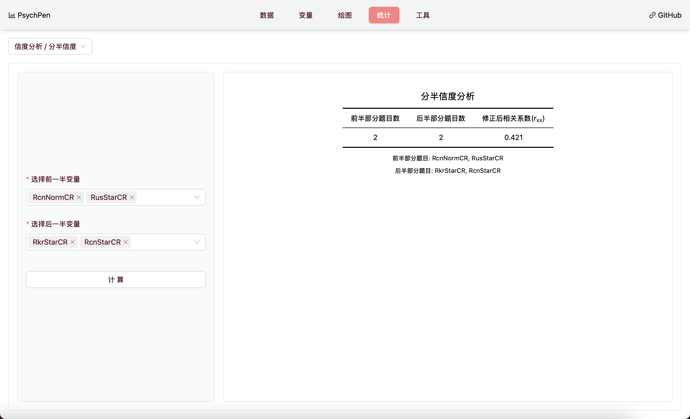 |

#### 5.6.3 同质性信度

如果各个题目是测量同一心理特质, 则各个题目得分间相关越高则信度越好; 同质性信度即是各个题目与总分的相关系数, 常用 alpha 系数表示 (应用中, alpha 的值至少要大于0.5, 最好能大于0.7), 近期也有越来越多的研究使用 omega 系数. 在本页面中, 你可以选择量表的所有题目, 点击 `计算` 按钮即可进行同质性信度检验, 可以同时计算 alpha 系数和 omega 系数.

你还可以选择分组变量, 以便对不同分组的数据进行信度检验

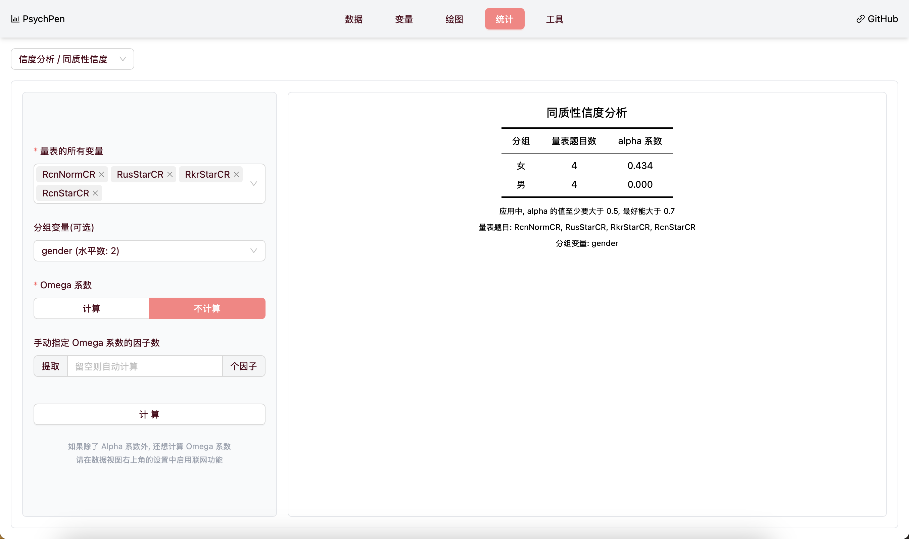

### 5.7 中介效应分析

中介效应分析用于检验一个变量对另一个变量的影响是否通过第三个变量来实现. 详见[作者的心理统计学笔记](https://blog.leafyee.xyz/2024/01/08/心理统计学/#中介效应)

#### 5.7.1 简单中介效应检验

简单中介效应模型只有一个自变量、一个因变量和一个中介变量. 在简单中介效应检验页面中, 你可以选择你要进行检验的自变量、因变量和中介变量, 点击 `计算` 按钮即可进行简单中介效应检验. 你还可以手动设置 Bootstrap 采样次数, 以便得到更准确的中介效应值和置信区间

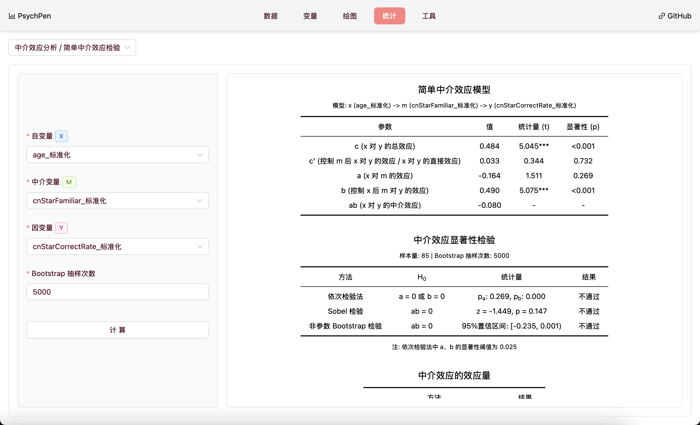

## 6 工具视图

工具视图中的功能无需导入数据即可使用. 你可在页面上方选择你要使用的工具, 进入对应的工具页面

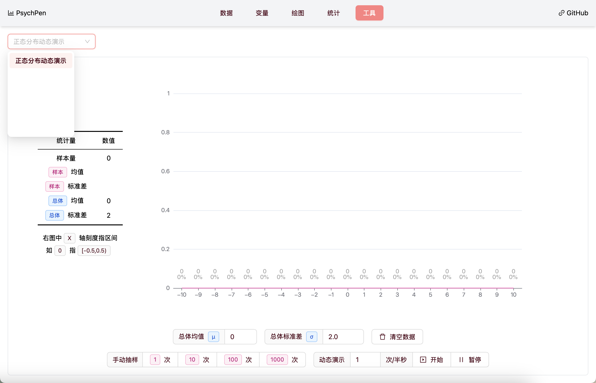

### 6.1 统计量与P值转换工具

在心理学和教育学研究中, 有时需要将统计量 (如 z 值、t 值、F 值等) 转换为 P 值, 或者将 P 值转换为统计量. 在统计量与P值转换工具中, 你可以输入统计量或 P 值 (t 分布和 F 分布等还需要输入自由度), 查看对应的 P 值或统计量结果

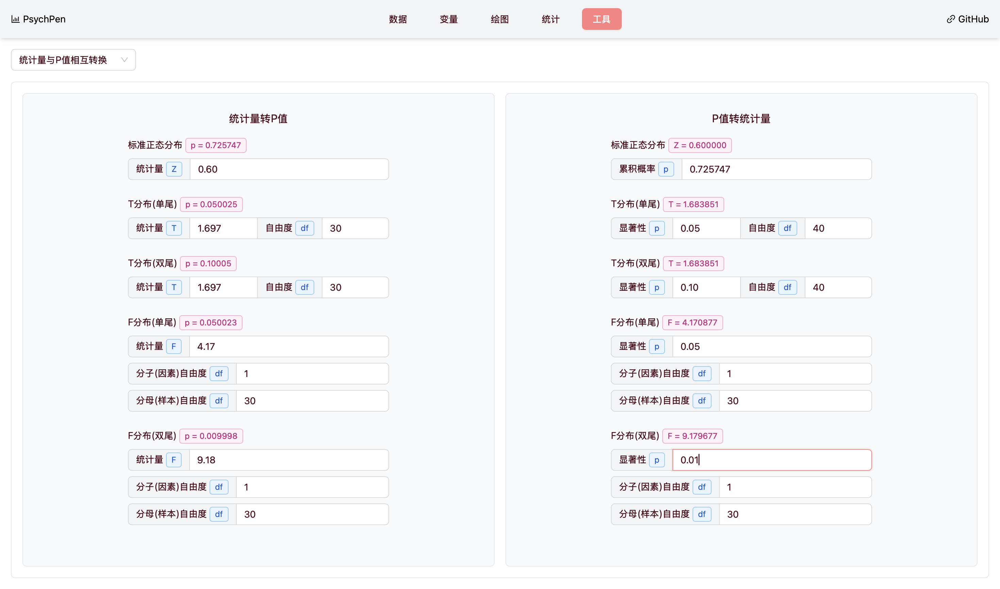

### 6.2 正态分布可视化演示工具

正态分布是心理学和教育学研究中经常使用的分布. 在正态分布可视化演示工具中, 你可以调整正态分布(总体)的均值和标准差, 并进行手动或自动(动态演示)抽样, 以便更好地理解正态分布的性质

视图左侧将分别显示 `样本` 和 `总体` 的一些信息, 右侧将显示当前样本的直方图和分布曲线. 底部可以进行 `手动抽样`、`动态演示`、`清除数据` 等操作

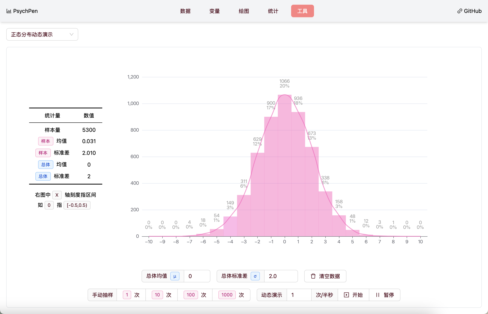

### 6.3 T分布可视化演示工具

T分布是假设检验中最常见的分布之一. 在T分布可视化演示工具中, 你可以供抽样的总体(正态分布)的均值和标准差, 以及T分布的自由度(即每次抽样的样本量减1), 并进行手动或自动(动态演示)抽样, 以便更好地理解T分布的性质和"样本均值的标准差"、"估计标准误"、"真实标准误"之间的细微区别

视图左侧将分别显示 `样本` 和 `总体` 的一些信息, 右侧将显示当前样本的直方图和分布曲线. 底部可以进行 `手动抽样`、`动态演示`、`清除数据` 等操作

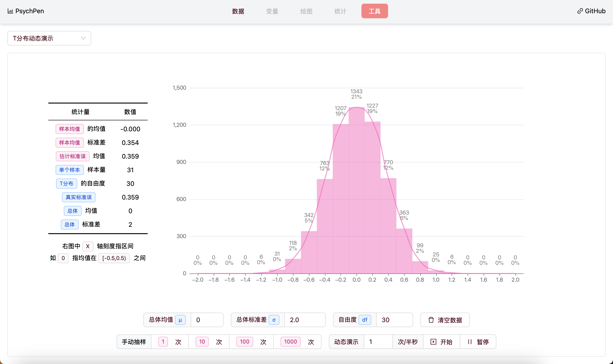

# PsychPen 开发文档

## 1 项目结构

- `public/` 静态资源目录
- `server/` R 语言服务端目录
- `src/` 源码目录
  - `App.tsx` 根组件
  - `tailwind.css` 全局样式文件
  - `types.d.ts` 类型定义
  - `lib/` 业务逻辑目录
    - `calculates/` 变量处理流程目录
    - `assistant/` AI辅助分析相关目录
    - `hooks/` 全局状态目录
    - `utils.ts` 工具函数
  - `components/` 组件目录
    - `assistant/` AI辅助分析组件
    - `data/` 数据视图组件
    - `plots/` 绘图视图组件
    - `statistics/` 统计视图组件
    - `tools/` 工具视图组件
    - `variable/` 变量视图组件

## 2 开发说明

1. 克隆本项目到本地

```bash
git clone https://github.com/LeafYeeXYZ/PsychPen.git
cd PsychPen
```

2. 安装依赖 (本项目使用 [bun](https://bun.sh) 作为包管理工具)

```bash
bun install
```

3. 启动项目

```bash
bun dev
```

4. 打包项目

```bash
bun run build
```

> PsychPen 基于 [PsychLib](https://github.com/LeafYeeXYZ/PsychLib) 进行部分统计分析, 基于 [PsychSheet](https://github.com/LeafYeeXYZ/PsychSheet) 进行数据导入导出, 欢迎也关注这两个项目

## 3 参考文献

- `基础统计` 刘红云. (2023). 教育与心理统计学. 北京师范大学出版社.
- `进阶统计` 刘红云. (2019). 高级心理统计. 中国人民大学出版社.
- `中介效应检验` 方杰, 张敏强, 李晓鹏. (2011). 中介效应的三类区间估计方法. 心理科学进展, 19(5), 765–774.
- `图表库` Li, D., Mei, H., Shen, Y., Su, S., Zhang, W., Wang, J., Zu, M., & Chen, W. (2018). ECharts: A declarative framework for rapid construction of web-based visualization. Visual Informatics, 2(2), 136–146. https://doi.org/10.1016/j.visinf.2018.04.011
