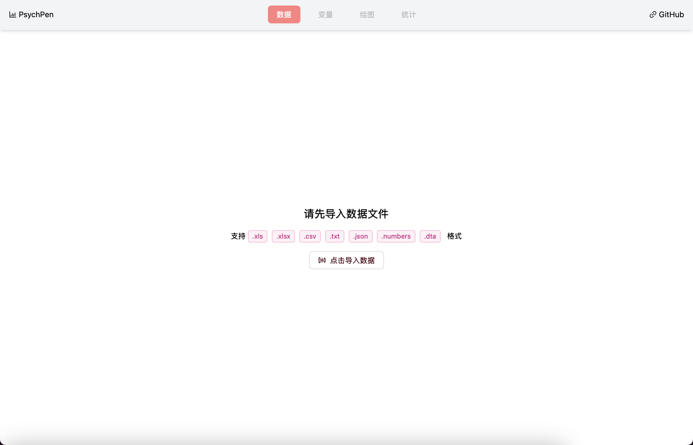

# PsychPen

**在线进行心理学统计分析和绘制统计图表**



## 项目说明

本项目是一个使用 `TypeScript` 语言编写, 用于心理学/教育学统计检验分析和图表绘制的在线工具; 相比于传统的心理学统计软件, 本项目具有**无需下载安装**、**跨平台**、**开源免费**、**新手友好**等优势; 由于图表绘制基于 `antv`, 因此相比于 `SPSS` 等软件, 本项目的图表更加美观、易于定制和导出

本软件所用的工具包括但不限于: `React`, `Vite`, `Ant Design`, `Ant Design Charts`, `Sheet.js`, `Math.js`, `HTML2Canvas`, `Simple-Statistics`, `@Stdlib/Stats` 等; 如果您对本项目感兴趣, 欢迎 `star`、`fork`、`watch` 或者提出 `issue` 和 `pull request`!

## 使用说明

请提前准备 `.xlsx`、`.xls`、`.csv`、`.txt`、`.json`、`.txt`、`.dta` 等格式的数据文件, 打开本项目的网站, 并导入数据文件, 即可进行数据分析和图表绘制

## 开发说明

1. 克隆本项目到本地
2. 安装依赖 (本项目使用 [bun](https://bun.sh) 作为包管理工具)
  ```bash
  bun install
  ```
3. 启动项目
  ```bash
  bun dev
  ```
4. 打包项目
  ```bash
  bun run build
  ```

## 路线图

- **数据管理**
  - [x] 数据导入 (基于 `sheet.js`)
  - [x] 数据和变量预览 
  - [ ] 支持导入 `.sav` 文件
  - [ ] 在线数据编辑 (以 `CSV` 文本的形式)
  - [x] 数据导出 (基于 `sheet.js`)
  - [x] 基础的缺失值定义 
  - [ ] 完善的缺失值处理 (当前为删除法)
- **绘图功能** (基于 `echarts`)
  - [ ] 箱线图
    - [x] 基础箱线图
    - [ ] 分组箱线图
  - [ ] 散点图
    - [x] 基础散点图
    - [ ] 一维散点图
  - [x] 图像导出 (基于 `html2canvas`)
- **统计功能** (近期基于 `simple-statistics`、`@stdlib/stats`、`math.js` 等库, 远期基于 `WebAssembly` (`pyodide` / `AssemblyScript`) 实现)
  - [ ] t 检验
    - [x] 单样本 t 检验
    - [ ] 独立样本 t 检验
    - [x] 配对样本 t 检验
  - [ ] 输出统计表对应的 `TeX` 代码
