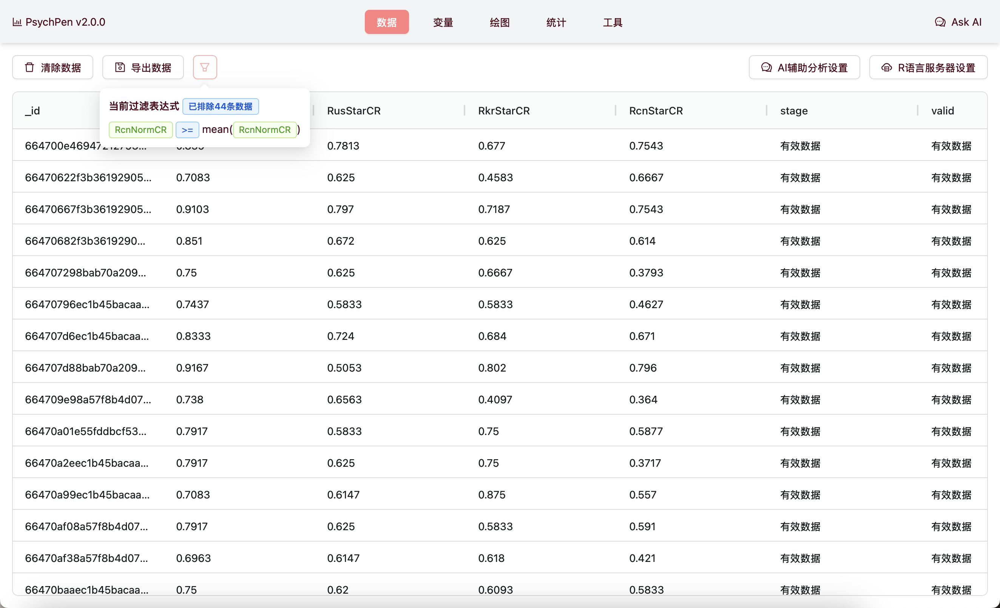
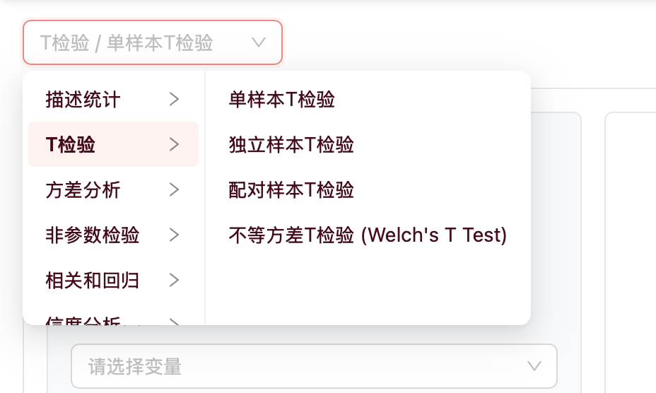

# PsychPen 使用文档

**在线进行心理学/教育学统计分析和数据可视化**, **立即体验: <https://spss.leafyee.xyz>**

- [PsychPen 使用文档](#psychpen-使用文档)
  - [1 项目简介](#1-项目简介)
  - [2 数据视图](#2-数据视图)
    - [2.1 数据导入](#21-数据导入)
    - [2.2 数据预览](#22-数据预览)
    - [2.3 数据导出](#23-数据导出)
    - [2.4 删除数据](#24-删除数据)
  - [3 变量视图](#3-变量视图)
    - [3.1 变量预览](#31-变量预览)
    - [3.2 定义变量缺失值](#32-定义变量缺失值)
    - [3.3 缺失值插值处理](#33-缺失值插值处理)
    - [3.4 生成标准化/中心化子变量](#34-生成标准化中心化子变量)
  - [4 绘图视图](#4-绘图视图)
  - [5 统计视图](#5-统计视图)
  - [6 工具视图](#6-工具视图)
    - [6.1 正态分布可视化演示工具](#61-正态分布可视化演示工具)
- [PsychPen 开发文档](#psychpen-开发文档)
  - [1 项目结构](#1-项目结构)
  - [2 开发说明](#2-开发说明)
  - [3 开发路线图](#3-开发路线图)

## 1 项目简介

PsychPen 是一个用于心理学/教育学专业的统计检验分析和图表绘制的在线工具. 相比于传统的心理学统计软件, PsychPen 具有无需下载安装、跨平台 (你甚至可以在平板和手机上使用)、安全可靠 (所有数据都在浏览器本地处理)、新手友好、开源免费等优势. 除此之外, PsychPen 依托于 Web 技术, 还实现了 SPSS 等老牌统计软件难以实现的3D图表、可交互图标、动态演示等功能, 可以帮助初学者更好地理解统计分布等概念

|  |  |  |
| :---: | :---: | :---: |
|  |  |  |

本文档将按照 PsychPen 的功能模块, 分别介绍其使用方法

> **引用信息**: `叶一杉. (2024). PsychPen: 一个用于心理学/教育学专业的统计检验分析和图表绘制的在线工具. https://github.com/LeafYeeXYZ/PsychPen`

## 2 数据视图

### 2.1 数据导入

进入 PsychPen 主页, 点击 `数据导入` 按钮, 选择你的数据文件 (支持多种格式, 如 `.csv`, `.xlsx`, `.dta` 等), 点击 `确定` 即可导入数据. 导入成功后, 你可以在数据视图中看到你的数据表格

| 导入前 | 导入后 |
| :---: | :---: |
|  |  |

### 2.2 数据预览

在数据视图中, 你可以查看你导入的数据表格. 点击表头可以对数据进行排序; 按住并拖动表头的数线可以调整列宽; 按住并拖动表头本身可以调整列的顺序


### 2.3 数据导出

在数据视图中, 点击 `导出数据` 按钮, 选择你要导出的数据格式 (支持 `.csv`, `.xlsx`, `.numbers`), 点击 `确定` 即可导出数据; 如果需要自定义文件名, 可以在 `文件名` 输入框中输入

导出的数据是经过 `定义缺失值`、`缺失值插值`、`生成标准化/中心化子变量` 等处理后的数据


### 2.4 删除数据

在数据视图中, 点击 `删除数据` 按钮, 确认删除即可删除当前的数据表格. 删除后, 你可以重新导入数据. 注意: 删除数据的操作不会影响到你导入的数据的原始文件



## 3 变量视图

变量视图集中了数据表格中的变量信息, 你可以在此页面对变量进行缺失值定义、缺失值插值、生成标准化/中心化子变量等操作; 进入变量视图后, 默认显示 `变量表格`, 你可以点击上方的按钮切换到其他功能页面


### 3.1 变量预览

在变量表格中, 你可以查看你导入的数据表格中的变量信息. 包括变量名、变量类型 (决定了能否用该变量进行一些数学运算)、变量的缺失值情况、变量的描述性统计信息 (如均值、标准差、最大值、最小值) 等

同样点击表头可以对数据进行排序; 按住并拖动表头的数线可以调整列宽; 按住并拖动表头本身可以调整列的顺序


### 3.2 定义变量缺失值

通常, 在研究数据中不会直接将缺失值留空, 而是将缺失值替换为特定的值, 以便于后续的数据处理 (例如用 -1、-99、99 等值表示缺失值). 在变量视图中, 你可以点击 `定义缺失值` 按钮, 在此页面定义这些缺失值, 以便将它们删除或插值

设置缺失值后, 你可以在 `变量表格` 中看到定义的缺失值的情况


### 3.3 缺失值插值处理

研究中会因为各种原因导致数据缺失, 如果样本量较大, 直接删除缺失值是一个不错的选择; 但在心理学和教育学研究中, 往往实验样本比较珍贵, 因此, 研究者往往会选择合适的插值法来将缺失值替换为有效值. 在变量视图中, 你可以点击 `缺失值插值` 按钮, 在此页面选择合适的插值方法, 以便将缺失值替换为有效值

插值处理后, 你可以在 `变量表格` 中看到插值的设置情况


### 3.4 生成标准化/中心化子变量

在数据分析中, 有时需要对原始数据进行处理. 标准化是指把 x 转换为 (x - μ) / σ, 从而让数据的均值为0, 方差为1; 中心化是指把 x 转换为 x - μ, 从而让数据的均值为0, 方差不变. 两种处理均不会改变数据的分布形状. 在变量视图中, 你可以点击 `生成标准化/中心化子变量` 按钮, 在此页面选择变量, 生成标准化/中心化后的子变量

生成子变量后, 你可以在 `变量表格` 中看到生成的子变量的情况


## 4 绘图视图

在绘图视图中, 你可以在页面左上角选择你要绘制的图表类型, 进入对应的图表绘制页面. 之后, 根据页面内容选择你要绘制的变量, 点击 `生成` 按钮即可生成图表. 图表生成后, 你可以点击 `保存图片` 按钮将图表保存为图片


## 5 统计视图

在统计视图中, 你可以在页面左上角选择你要进行的统计检验类型, 进入对应的统计检验页面. 之后, 根据页面内容选择你要进行统计检验的变量, 点击 `计算` 按钮即可进行统计检验. 检验结果会显示在页面右侧的结果区域



## 6 工具视图

工具视图中的功能无需导入数据即可食用. 你可在页面上方选择你要使用的工具, 进入对应的工具页面


### 6.1 正态分布可视化演示工具

正态分布是心理学和教育学研究中经常使用的分布. 在正态分布可视化演示工具中, 你可以调整正态分布(总体)的均值和标准差, 并进行手动或自动(动态演示)抽样, 以便更好地理解正态分布的性质

视图左侧将分别显示 `样本` 和 `总体` 的一些信息, 右侧将显示当前样本的直方图和分布曲线. 底部可以进行 `手动抽样`、`动态演示`、`清除数据` 等操作


# PsychPen 开发文档

## 1 项目结构

```bash
App.tsx
├── DataView.tsx # 数据视图
├── VariableView.tsx # 变量视图
|    ├── variable/*.tsx # 变量视图的子组件
├── StatisticView.tsx # 统计视图
|    ├── statistic/*.tsx # 统计视图的子组件
├── PlotView.tsx # 绘图视图
|    ├── plot/*.tsx # 绘图视图的子组件
├── ToolView.tsx # 工具视图
|    ├── tool/*.tsx # 工具视图的子组件
lib/useZustand.tsx # 全局状态管理
lib/utils.ts # 工具函数
```

## 2 开发说明

1. 克隆本项目到本地
  ```bash
  git clone https://github.com/LeafYeeXYZ/PsychPen.git
  cd PsychPen
  ```
2. 安装依赖 (本项目使用 [bun](https://bun.sh) 作为包管理工具)
  ```bash
  bun install
  ```
3. 启动项目
  ```bash
  bun dev
  ```
4. 打包项目
  ```bash
  bun run build
  ```

## 3 开发路线图

- **数据管理**
  - [x] 数据导入 (基于 `sheet.js`)
  - [x] 数据和变量预览 (基于 `AG-Grid`)
  - [x] 支持导入 `.sav` 文件 (基于 [mhermher/savvy](https://github.com/mhermher/savvy) `但是不知道为什么不能直接安装, 只能手动下载源码`)
  - [x] 数据导出 (基于 `sheet.js`)
  - [x] 基础的缺失值定义 
  - [x] 缺失值插值处理
  - [x] 将某个变量的所有数值标准化, 生成新的变量
  - [x] 将某个变量的所有数值中心化, 生成新的变量
  - [ ] 将每个变量离散化为指定若干个区间, 生成新的变量 (等宽/等频/聚类分析 `k-means`)
  - [ ] 数据过滤/筛选 (可能需要重构数据管理模块)
  - [ ] 根据现有变量计算生成新的变量 (可能需要重构数据管理模块)
- **绘图功能** (基于 `echarts`)
  - 箱线图
    - [x] 基础箱线图
  - 散点图
    - [x] 基础散点图
    - [x] 3D散点图
  - 折线图
    - [x] 基础折线图
    - [ ] 堆叠折线图
  - 直方图
    - [ ] 基础直方图 (可以绘制误差线)
    - [x] 三维直方图 
  - 其他
    - [x] 词云图 (基于 `echarts-wordcloud` 和 `jieba-wasm`)
  - [x] 图像导出 (基于 `html2canvas`)
- **统计功能** (近期基于 `@stdlib/stdlib` 库, 远期基于 `WebAssembly` (`pyodide` / `AssemblyScript`) 实现)
  - t 检验
    - [x] 单样本 t 检验
    - [x] 独立样本 t 检验
    - [x] 配对样本 t 检验
  - 非参数检验
    - [x] Kolmogorov-Smirnov 检验
    - [x] Levene 检验
  - 相关和回归
    - [x] Pearson 相关系数
- **其他工具**
  - [x] 正态分布可视化演示工具

> 本项目使用了 `ECharts` 作为图表绘制库: `Li, D., Mei, H., Shen, Y., Su, S., Zhang, W., Wang, J., Zu, M., & Chen, W. (2018). ECharts: A declarative framework for rapid construction of web-based visualization. Visual Informatics, 2(2), 136–146. https://doi.org/10.1016/j.visinf.2018.04.011`
