# PsychPen 使用文档

**AI加持的在线心理学/教育学统计分析和数据可视化软件**, **立即体验: <https://psychpen.leafyee.xyz>**

> `v1.2.0 引用信息`: `叶一杉. (2024). PsychPen: 在线统计分析和数据可视化工具 (v1.2.0) [Computer software]. GitHub. https://github.com/LeafYeeXYZ/PsychPen/tree/v1.2.0`  
> `v1.7.0 引用信息`: `叶一杉. (2024). PsychPen: 在线统计分析和数据可视化工具 (v1.7.0) [Computer software]. GitHub. https://github.com/LeafYeeXYZ/PsychPen/tree/v1.7.0`  
> `v2.0.0 引用信息`: `叶一杉. (2025). PsychPen: 在线统计分析和数据可视化工具 (v2.0.0) [Computer software]. GitHub. https://github.com/LeafYeeXYZ/PsychPen/tree/v2.0.0`

## 目录

- [PsychPen 使用文档](#psychpen-使用文档)
  - [目录](#目录)
  - [1 项目简介](#1-项目简介)
  - [2 数据视图](#2-数据视图)
    - [2.1 数据导入](#21-数据导入)
    - [2.2 数据预览/导出/删除](#22-数据预览导出删除)
    - [2.3 R语言服务器设置](#23-r语言服务器设置)
    - [2.4 AI辅助分析设置](#24-ai辅助分析设置)
    - [2.5 AI助手](#25-ai助手)
  - [3 变量视图](#3-变量视图)
    - [3.1 变量预览](#31-变量预览)
    - [3.2 定义变量缺失值](#32-定义变量缺失值)
    - [3.3 缺失值插值处理](#33-缺失值插值处理)
    - [3.4 变量标准化/中心化/离散化](#34-变量标准化中心化离散化)
    - [3.5 数据筛选](#35-数据筛选)
    - [3.6 计算变量](#36-计算变量)
      - [3.6.1 表达式语法](#361-表达式语法)
      - [3.6.2 用于数据标签](#362-用于数据标签)
  - [4 绘图视图](#4-绘图视图)
    - [4.1 折线图](#41-折线图)
      - [4.1.1 基础折线图](#411-基础折线图)
      - [4.1.2 平行折线图](#412-平行折线图)
    - [4.2 散点图](#42-散点图)
      - [4.2.1 基础散点图](#421-基础散点图)
      - [4.2.2 三维散点图](#422-三维散点图)
    - [4.3 直方图/柱状图](#43-直方图柱状图)
      - [4.3.1 基础柱状图](#431-基础柱状图)
      - [4.3.2 三维柱状图](#432-三维柱状图)
      - [4.3.3 分组柱状图](#433-分组柱状图)
    - [4.4 箱线图](#44-箱线图)
      - [4.4.1 基础箱线图](#441-基础箱线图)
    - [4.5 饼图](#45-饼图)
      - [4.5.1 基础饼图](#451-基础饼图)
    - [4.6 其他](#46-其他)
      - [4.6.1 词云图](#461-词云图)
      - [4.6.2 Q-Q 图](#462-q-q-图)
  - [5 统计视图](#5-统计视图)
    - [5.1 描述统计](#51-描述统计)
    - [5.2 t 检验](#52-t-检验)
      - [5.2.1 单样本 t 检验](#521-单样本-t-检验)
      - [5.2.2 配对样本 t 检验](#522-配对样本-t-检验)
      - [5.2.3 独立样本 t 检验](#523-独立样本-t-检验)
      - [5.2.4 不等方差 t 检验 (Welch's t 检验)](#524-不等方差-t-检验-welchs-t-检验)
    - [5.3 方差分析](#53-方差分析)
      - [5.3.1 单因素方差分析](#531-单因素方差分析)
      - [5.3.2 重复测量方差分析](#532-重复测量方差分析)
    - [5.4 非参数检验](#54-非参数检验)
      - [5.4.1 Kolmogorov-Smirnov 检验](#541-kolmogorov-smirnov-检验)
      - [5.4.2 Levene 检验](#542-levene-检验)
      - [5.4.3 峰度和偏度检验](#543-峰度和偏度检验)
    - [5.5 相关和回归](#55-相关和回归)
      - [5.5.1 Pearson 相关检验](#551-pearson-相关检验)
      - [5.5.2 一元线性回归](#552-一元线性回归)
      - [5.5.3 二元线性回归](#553-二元线性回归)
      - [5.5.4 多元线性回归](#554-多元线性回归)
    - [5.6 信度分析](#56-信度分析)
      - [5.6.1 重测信度/复本信度](#561-重测信度复本信度)
      - [5.6.2 分半信度](#562-分半信度)
      - [5.6.3 同质性信度](#563-同质性信度)
    - [5.7 中介效应分析](#57-中介效应分析)
      - [5.7.1 简单中介效应检验](#571-简单中介效应检验)
  - [6 工具视图](#6-工具视图)
    - [6.1 统计量与P值转换工具](#61-统计量与p值转换工具)
    - [6.2 正态分布可视化演示工具](#62-正态分布可视化演示工具)
    - [6.3 T分布可视化演示工具](#63-t分布可视化演示工具)
- [PsychPen 开发文档](#psychpen-开发文档)
  - [1 项目结构](#1-项目结构)
  - [2 开发说明](#2-开发说明)
  - [3 R语言服务端部署说明](#3-r语言服务端部署说明)
    - [3.1 直接拉取镜像运行 (推荐)](#31-直接拉取镜像运行-推荐)
    - [3.2 本地构建和运行](#32-本地构建和运行)
    - [3.3 直接运行R脚本](#33-直接运行r脚本)
  - [4 参考文献](#4-参考文献)

## 1 项目简介

PsychPen 是一个AI加持的心理学/教育学统计分析和数据可视化在线软件. 相比于传统的心理学统计软件, PsychPen 具有无需下载安装、跨平台 (你甚至可以在平板和手机上使用)、初学者友好 (具有内置的、深度集成的 AI 辅助功能)、开源免费等优势. 此外, PsychPen 依托于 Web 技术, 还实现了 SPSS 等老牌统计软件难以实现的3D图表、可交互图标、动态演示等功能, 可以帮助初学者更好地理解统计学相关概念

|   | 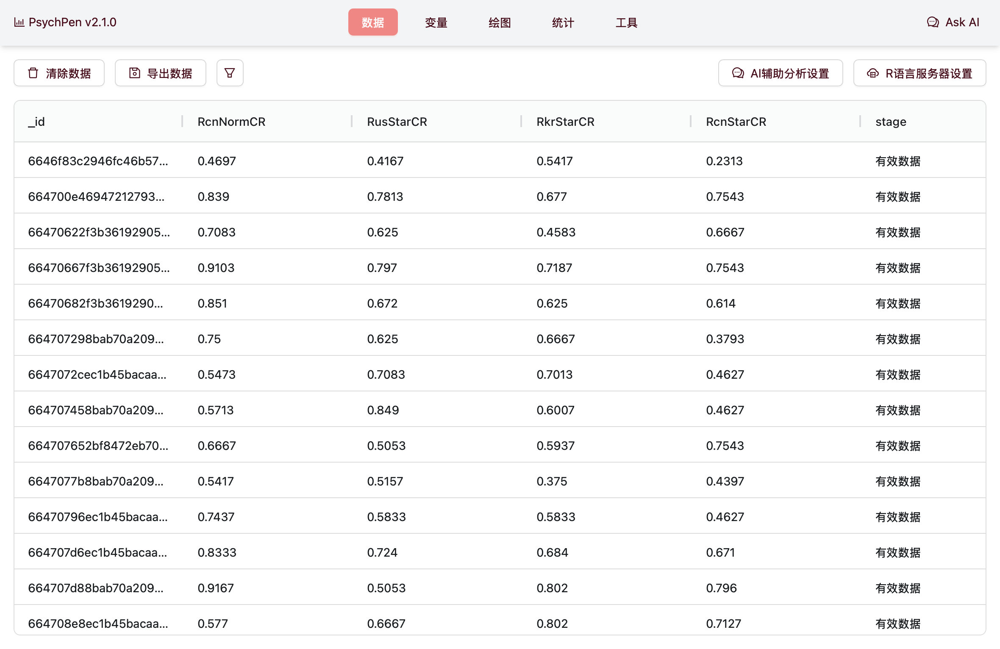  |  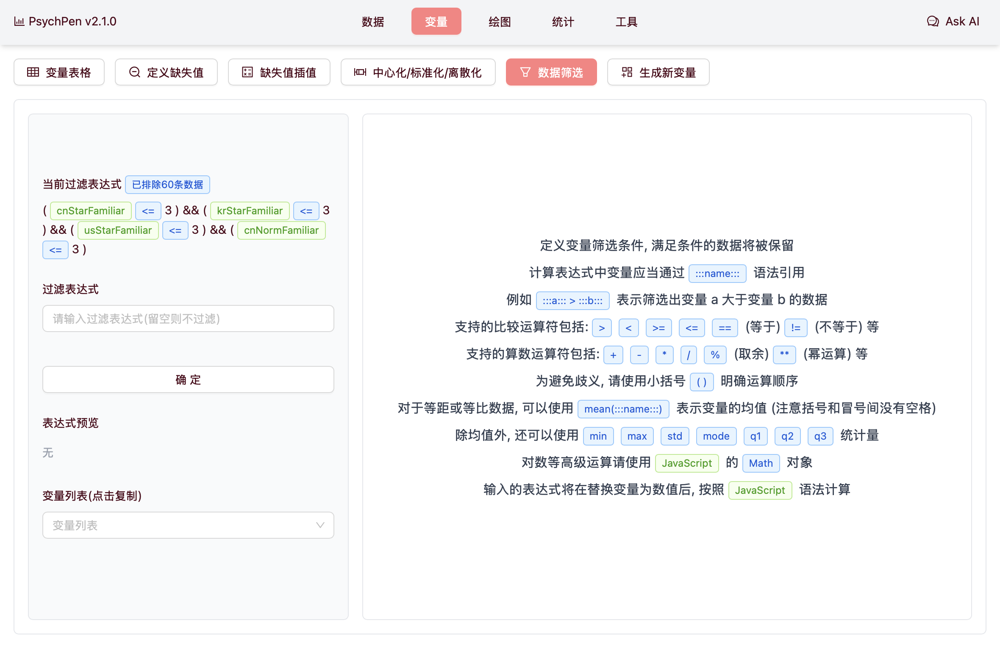  |
| :---------------------: | :---------------------: | :---------------------: |
|  |  |  |

PsychPen 有 `数据`、`变量`、`绘图`、`统计`、`工具` 五大功能模块, 本文档将分别介绍其使用方法

## 2 数据视图

### 2.1 数据导入

进入 PsychPen 主页, 点击 `数据导入` 按钮, 选择你的数据文件 (支持多种格式, 如 `.csv`, `.xlsx`, `.dta`, `.parquet` 等), 点击 `确定` 即可导入数据. 导入成功后, 你可以在数据视图中看到你的数据表格

|         导入前         |         导入后         |
| :--------------------: | :--------------------: |
|  |  |

### 2.2 数据预览/导出/删除

在数据视图中, 你可以查看你导入的数据表格. 点击表头可以对数据进行排序; 按住并拖动表头的数线可以调整列宽; 按住并拖动表头本身可以调整列的顺序


点击左上角 `导出数据` 按钮, 选择你要导出的数据格式 (支持 `.csv`, `.xlsx`, `.numbers` 等), 点击 `确定` 即可导出数据; 如果需要自定义文件名, 可以在 `文件名` 输入框中输入

导出的数据是经过 `定义缺失值`、`缺失值插值`、`生成标准化/中心化子变量` 等处理后的数据, 即**在数据视图实际看到的数据**

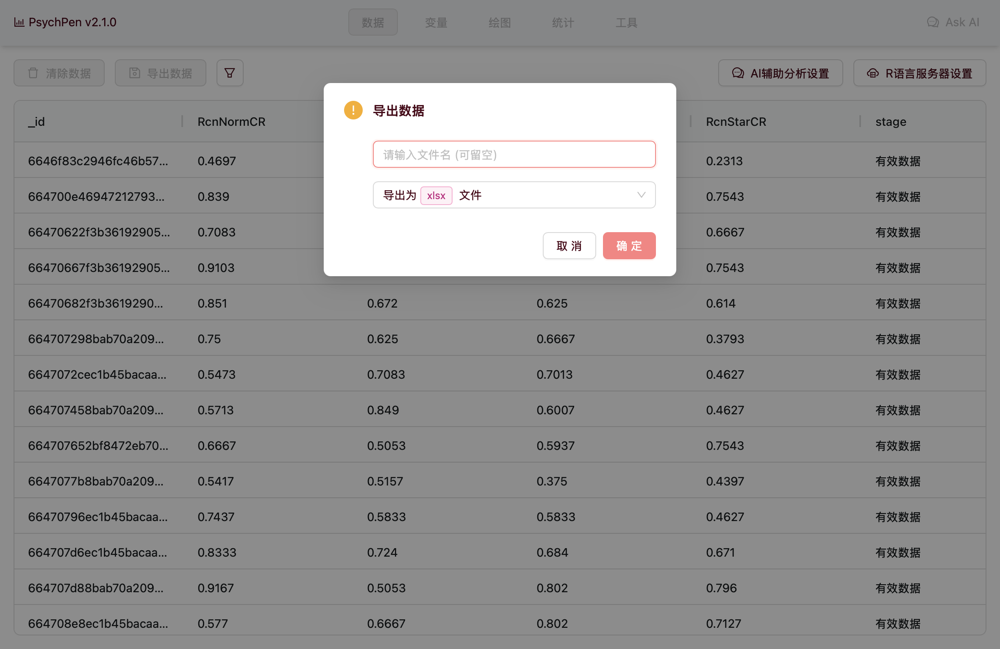

点击左上角 `删除数据` 按钮, 确认删除即可删除当前的数据表格. 删除后, 你可以重新导入数据. 注意: 删除数据的操作不会影响到你导入的数据的原始文件

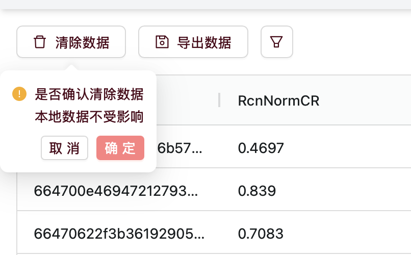

### 2.3 R语言服务器设置

**注: 本部分内容仅适用于高级用户, 一般用户无需设置**

由于 `JavaScript` 的相关统计库较少, 基于 `Docker` 和 `R` 开发了一个简单的服务端, 用于提供执行 `R` 脚本的接口 (当前仅用于计算信度 Omega 系数). 在参考[3 R语言服务端部署说明](#3-r语言服务端部署说明) 部署服务端后, 你可以在右上角点击 `R语言服务器设置` 按钮, 在此页面启用R语言服务器, 输入服务端地址和密码, 即可使用相关高级统计分析功能


### 2.4 AI辅助分析设置

PsychPen 创新性地引入了 AI 辅助分析功能, 可以让 AI 助手基于你的数据和你的需求, 针对性地给出建议, 甚至直接替你操作 PsychPen 完成统计分析和图表绘制. PsychPen 支持所有实现了 [function calling](https://platform.openai.com/docs/guides/function-calling) 并兼容 OpenAI API 规范的大语言模型 (如 [DeepSeek](https://platform.deepseek.com/)), 你只需根据你所用的 AI 模型的使用文档, 在右上角的 `AI辅助分析设置` 中开启 `AI辅助分析` 功能, 并输入 `baseUrl`、`apiKey`、`modelId` 等参数, 即可点击页面右上角的 `Ask AI` 按钮, 与 AI 助手进行交互


### 2.5 AI助手

在根据[2.4 AI辅助分析设置](#24-ai辅助分析设置) 设置好 AI 辅助分析后, 你可以点击右上角的 `Ask AI` 按钮, 与 AI 助手进行交互. 你可以询问它 PsychPen 的使用方法、对你的数据的见解、统计分析的建议等, 也可以直接指示它帮你操作 PsychPen 完成统计分析、图表绘制、数据导出、页面跳转、计算变量等操作

| 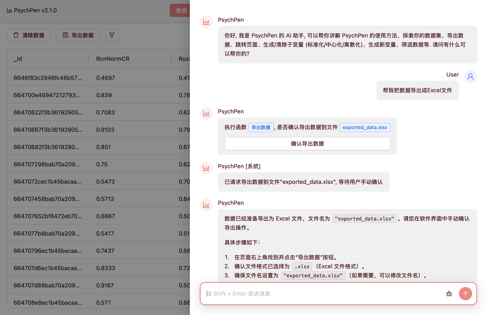 | 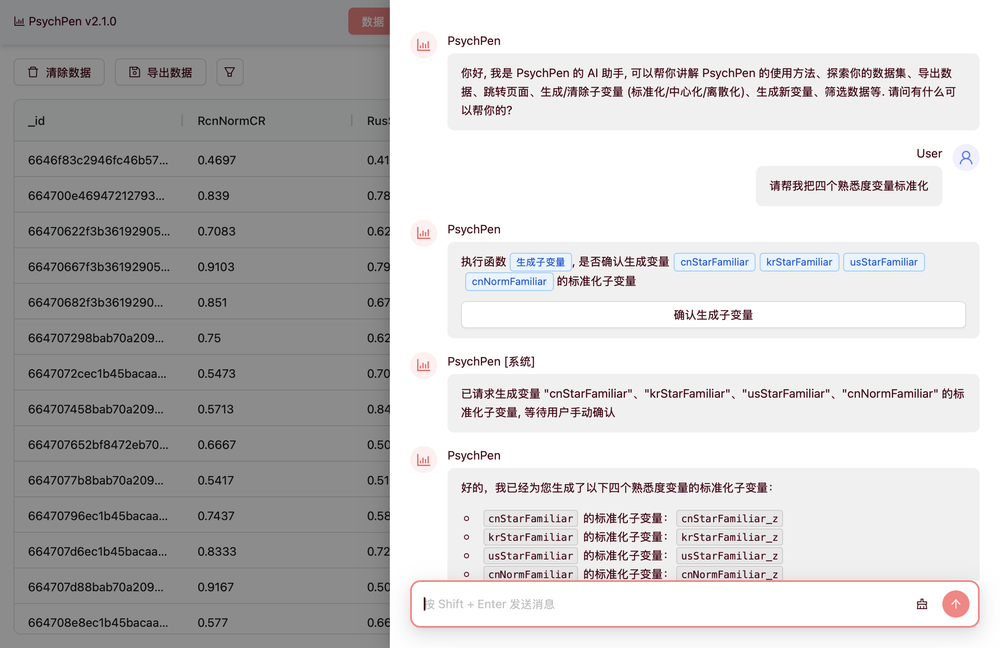 |
| :--------------------: | :--------------------: |

## 3 变量视图

变量视图集中了数据表格中的变量信息, 你可以在此页面对变量进行缺失值定义、缺失值插值、生成标准化/中心化子变量等操作; 进入变量视图后, 默认显示 `变量表格`, 你可以点击上方的按钮切换到其他功能页面


### 3.1 变量预览

在变量表格中, 你可以查看你导入的数据表格中的变量信息. 包括变量名、变量类型 (决定了能否用该变量进行一些数学运算)、变量的缺失值情况、变量的描述性统计信息 (如均值、标准差、最大值、最小值) 等

同样点击表头可以对数据进行排序; 按住并拖动表头的数线可以调整列宽; 按住并拖动表头本身可以调整列的顺序

注意: PsychPen 计算众数的方式是: 如果有多个众数, 则显示皮尔逊经验公式计算的众数 (中位数 _ 3 - 均值 _ 2)


### 3.2 定义变量缺失值

通常, 在研究数据中不会直接将缺失值留空, 而是将缺失值替换为特定的值, 以便于后续的数据处理 (例如用 -1、-99、99 等值表示缺失值). 在变量视图中, 你可以点击 `定义缺失值` 按钮, 在此页面定义这些缺失值, 以便将它们删除或插值

设置缺失值后, 你可以在 `变量表格` 中看到定义的缺失值的情况

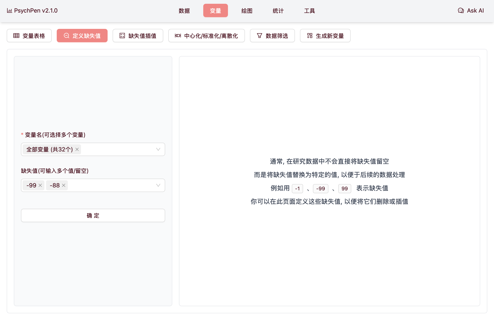

### 3.3 缺失值插值处理

研究中会因为各种原因导致数据缺失, 如果样本量较大, 直接删除缺失值是一个不错的选择; 但在心理学和教育学研究中, 往往实验样本比较珍贵, 因此, 研究者往往会选择合适的插值法来将缺失值替换为有效值. 在变量视图中, 你可以点击 `缺失值插值` 按钮, 在此页面选择合适的插值方法, 以便将缺失值替换为有效值

插值处理后, 你可以在 `变量表格` 中看到插值的设置情况


### 3.4 变量标准化/中心化/离散化

在数据分析中, 有时需要对原始数据进行处理. 标准化是指把 x 转换为 (x - μ) / σ, 从而让数据的均值为0, 方差为1; 中心化是指把 x 转换为 x - μ, 从而让数据的均值为0, 方差不变. 两种处理均不会改变数据的分布形状.

在变量视图中, 你可以点击 `标准化/中心化/离散化` 按钮, 在此页面选择变量, 生成标准化/中心化/离散化后的子变量; 如果选择了离散化, 你还需要选择离散化的方法 (等宽/等频/聚类分析 `k-means`) 和离散化的区间数. 生成子变量后, 你可以在 `变量表格` 和 `数据` 视图中看到生成的子变量


### 3.5 数据筛选

数据筛选可以让你根据自己的需求, 选择性地**保留**满足过滤规则的数据. 过滤基于原数据 (如 `高于平均值` 指的是高于未过滤的数据的平均值), 过滤后会生成新描述统计数据

在变量视图中, 你可以点击 `数据筛选` 按钮, 在此页面选择变量, 选择过滤条件, 如有需要再填写过滤条件的值, 点击 `生成` 按钮即可生成新数据. 生成后, 你可以在 `变量表格` 和 `数据` 视图中看到生成的新数据


### 3.6 计算变量

在心理学和教育学研究中, 通常需要对原始数据进行一些计算, 以得到最终用于分析的变量. 在变量视图中, 你可以点击 `计算变量` 按钮, 在此页面输入计算表达式和新变量名, 点击 `计算` 按钮并确认即可生成新变量. 生成后, 你可以在 `变量表格` 和 `数据` 视图中看到生成的新变量

同时, 你也可以为新变量设置缺失值和插值, 以及标准化/中心化/离散化等; 你还可以导出新数据, 以便后续分析


#### 3.6.1 表达式语法

|      符号      |                                         含义                                          |
| :------------: | :-----------------------------------------------------------------------------------: |
|      `+`       |                                    同数学中的加号                                     |
|      `-`       |                                    同数学中的减号                                     |
|      `*`       |                                    同数学中的乘号                                     |
|      `/`       |                                    同数学中的除号                                     |
|      `**`      |                                    同数学中的乘方                                     |
| `:::变量名:::` |                    引用其他变量的值, 会在计算时替换为指定变量的值                     |
|      `%`       |                                        取余数                                         |
|      `()`      |          小括号, 用于明确运算顺序; 注意: 没有中括号和大括号, 请都使用小括号           |
|  `Math.abs()`  | 同数学中的绝对值, 如 `Math.abs( :::a::: - :::b::: )` 表示变量 `a` 和 `b` 的差的绝对值 |
| `Math.sqrt()`  |           同数学中的平方根, 如 `Math.sqrt( :::a::: )` 表示变量 `a` 的平方根           |

> 更多数学函数请参考 [MDN Web Docs](https://developer.mozilla.org/zh-CN/docs/Web/JavaScript/Reference/Global_Objects/Math)

```typescript
// 将量表的多个题目分数求均值
( :::题目1::: + :::题目2::: + :::题目3::: + :::题目4::: + :::题目5::: ) / 5
// 处理反向计分的题目
( :::题目1::: + ( 6 - :::题目2::: ) + :::题目3::: + ( 6 - :::题目4::: ) + :::题目5::: ) / 5
// 复杂一些的计算
( :::题目1::: ** 2 ) + ( Math.sqrt( :::题目2::: ) ) + ( Math.abs( :::题目3::: - :::题目4::: ) )
```

#### 3.6.2 用于数据标签

计算变量还可以用来给数据打标签, 以便于分析时更好地理解数据; `条件 ? 条件满足时的值 : 条件不满足时的值` 称为三元运算符, 用于简单的条件判断

```typescript
// 原始数据中的性别以 `0` 和 `1` 表示, 把它们转换为 `男` 和 `女`
:::性别::: == 0 ? '男' : '女'
// 原始数据中的年级以 `1`、`2`、`3`、`4` 表示, 把它们转换为 `大一`、`大二`、`大三`、`大四`
:::年级::: == 1 ? '大一' : :::年级::: == 2 ? '大二' : :::年级::: == 3 ? '大三' : '大四'
```

> 注意: 比较时推荐使用 `==` 和 `!=` (即不严格比较, 数字 `1` 可以等于字符 `'1'`), 不推荐使用 `===` 和 `!==` (即严格比较, 数字 `1` 不等于字符 `'1'`); 这可以避免一些不必要的错误

## 4 绘图视图

在绘图视图中, 你可以在页面左上角选择你要绘制的图表类型, 进入对应的图表绘制页面. 之后, 根据页面内容选择你要绘制的变量, 点击 `生成` 按钮即可生成图表. 图表生成后, 你可以点击 `保存图片` 按钮将图表保存为图片

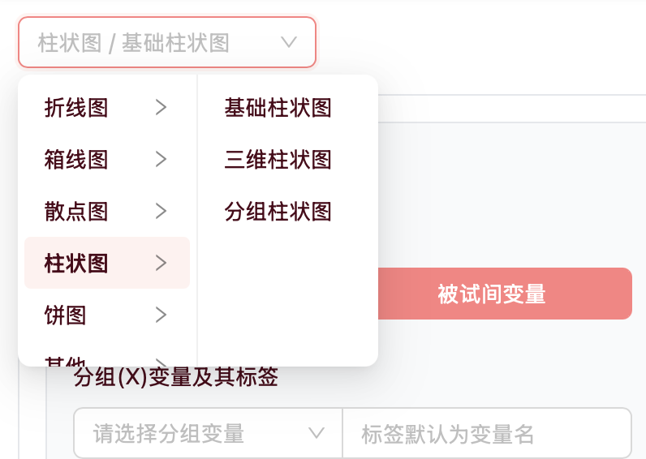

### 4.1 折线图

#### 4.1.1 基础折线图

在基础折线图页面中, 你可以选择你要进行绘图的变量的类型 (被试内变量/被试间变量). 如果是被试内变量, 你需要选择你要进行绘图的变量 (即X轴上的不同值); 如果是被试间变量, 你需要选择你要进行检验的数据变量 (Y轴数据) 和分组变量 (X轴上的不同值). 点击 `生成` 按钮即可生成图片, 生成后, 点击 `保存图片` 按钮可以保存图片

此外, 你还可以自定义 X 轴和 Y 轴的标签、选择折线图显示的统计量、是否启用折线平滑、是否显示数据标签、自定义标题等

|       被试内变量       |       被试间变量       |
| :--------------------: | :--------------------: |
|  |  |

#### 4.1.2 平行折线图

在平行折线图页面中, 你可以选择你要进行绘图的变量, 每个选择的变量都是 X 轴上的一条竖线. 每个数据都会成为连接这些竖线的一条横向折线. 点击 `生成` 按钮即可生成图片, 生成后, 点击 `保存图片` 按钮可以保存图片

此外, 你还可以自定义每个变量的标签、折线的宽度和颜色、自定义标题等


### 4.2 散点图

#### 4.2.1 基础散点图

在基础散点图页面中, 你可以选择你要进行绘图 X 轴和 Y 轴的变量. 点击 `生成` 按钮即可生成图片, 生成后, 点击 `保存图片` 按钮可以保存图片

此外, 你还可以自定义 X 轴和 Y 轴的标签、自定义标题、自定义散点大小、绘制回归线、显示回归方程等


#### 4.2.2 三维散点图

在三维散点图页面中, 你可以选择你要进行绘图的 X 轴、Y 轴和 Z 轴的变量. 点击 `生成` 按钮即可生成图片, 生成后, 点击 `保存图片` 按钮可以保存图片

此外, 你还可以自定义 X 轴、Y 轴和 Z 轴的标签、自定义标题等


### 4.3 直方图/柱状图

#### 4.3.1 基础柱状图

在基础柱状图页面中, 你可以选择你要进行绘图的变量的类型 (被试内变量/被试间变量). 如果是被试内变量, 你需要选择你要进行绘图的变量; 如果是被试间变量, 你需要选择你要进行检验的数据变量 (Y轴数据) 和分组变量 (X轴上的不同值). 点击 `生成` 按钮即可生成图片, 生成后, 点击 `保存图片` 按钮可以保存图片

此外, 你还可以自定义 X 轴和 Y 轴的标签、自定义标题、是否显示误差棒、误差棒的内容、是否显示数据标签等

|       被试内变量       |       被试间变量        |
| :--------------------: | :---------------------: |
|  |  |

#### 4.3.2 三维柱状图

在三维柱状图页面中, 你可以选择你要进行绘图的 X 轴、Y 轴和 Z 轴的变量. 点击 `生成` 按钮即可生成图片, 生成后, 点击 `保存图片` 按钮可以保存图片

此外, 你还可以自定义 X 轴、Y 轴和 Z 轴的标签、柱状图的统计量、自定义标题等


#### 4.3.3 分组柱状图

在分组柱状图页面中, 你可以选择你要进行绘图的分组变量 (X轴上的不同值) 和数据变量 (每个X轴上的值需要显示的Y轴数据). 点击 `生成` 按钮即可生成图片, 生成后, 点击 `保存图片` 按钮可以保存图片

此外, 你还可以自定义 X 轴和 Y 轴的标签、分组变量每一组的标签、数据变量每一项的标签、误差棒的内容等


### 4.4 箱线图

#### 4.4.1 基础箱线图

在基础箱线图页面中, 你可以选择你要进行绘图的变量的类型 (被试内变量/被试间变量). 如果是被试内变量, 你需要选择你要进行绘图的变量; 如果是被试间变量, 你需要选择你要进行检验的数据变量 (Y轴数据) 和分组变量 (X轴上的不同值). 点击 `生成` 按钮即可生成图片, 生成后, 点击 `保存图片` 按钮可以保存图片

此外, 你还可以自定义 X 轴和 Y 轴的标签、自定义标题等

|       被试内变量       |       被试间变量       |
| :--------------------: | :--------------------: |
|  |  |

### 4.5 饼图

#### 4.5.1 基础饼图

在基础饼图页面中, 你可以选择你要进行绘图的变量. 点击 `生成` 按钮即可生成图片, 生成后, 点击 `保存图片` 按钮可以保存图片

此外, 你还可以自定义标题、是否显示数据标签、数据标签的内容等


### 4.6 其他

#### 4.6.1 词云图

在词云图页面中, 你可以选择你要进行绘图的变量, 并选择合适的词语过滤规则 (如 `非中文常见字` 会过滤掉除常见中文字外的所有字符), 也可自行输入过滤规则 (字词匹配或正则表达式, 如下图所示), 点击 `生成` 按钮即可生成图片, 生成后, 点击 `保存图片` 按钮可以保存图片

此外, 你还可以自定义词云图的颜色、词云图的形状、单词最大和最小尺寸、单词旋转角度、手动关闭词语切分等

注意: 首次生成词云图时, 由于需要加载中文词语切分的模块, 可能速度较慢, 请耐心等待

|  |  |
| :---------------------: | :---------------------: |

#### 4.6.2 Q-Q 图

在 Q-Q 图 (Quantile-Quantile Plot, 即分位数-分位数图) 页面中, 你可以选择你要进行绘图的变量 (或选择标准正态分布), 点击 `生成` 按钮即可生成图片, 生成后, 点击 `保存图片` 按钮可以保存图片

此外, 你还可以自定义标题、是否标准化数据、取点的数量等


## 5 统计视图

在统计视图中, 你可以在页面左上角选择你要进行的统计检验类型, 进入对应的统计检验页面. 之后, 根据页面内容选择你要进行统计检验的变量, 点击 `计算` 按钮即可进行统计检验. 检验结果会显示在页面右侧的结果区域

注: 本应用的所有显著性标注 \* 均表示 P < 0.05, ** 表示 P < 0.01, \*** 表示 P < 0.001


### 5.1 描述统计

在描述统计页面中, 你可以查看你选择的变量的描述性统计信息. 既可以对被试内变量 (一个或多个导入的列) 进行描述统计, 也可以对被试间变量 (一列作为数据, 一列作为分组) 进行描述统计. 描述统计信息包括均值、标准差、最大值、最小值、中位数、四分位数等, 可按需选择

|       被试内变量       |       被试间变量       |
| :--------------------: | :--------------------: |
|  |  |

### 5.2 t 检验

t 检验是最基础的统计检验之一, 用于检验两组数据 (或一组数据与指定值) 的均值是否有显著差异. 显著差异意味着两组数据的均值差异不是由抽样误差造成的, 而是由总体差异造成的. 结果中给出的 P 值表示"这个差异是由抽样误差造成的"的概率, P 值越小, 说明差异越显著; 通常, P 值小于 0.05 (即差异由抽样误差造成的概率小于 5%) 时, 认为差异显著

t 检验有一些前提假设, 如数据服从正态分布、方差齐性. 在进行 t 检验前, 推荐先使用 Kolmogorov-Smirnov 检验 (检验数据是否服从正态分布) 和 Levene 检验 (检验方差是否齐性), 如果数据符合前提假设, 再进行 t 检验; 否则, 可以考虑使用非参数检验

#### 5.2.1 单样本 t 检验

单样本 t 检验用于检验一组数据的均值是否与指定值有显著差异. 在单样本 t 检验页面中, 你可以选择你要进行检验的变量, 输入你要检验的指定值, 点击 `计算` 按钮即可进行单样本 t 检验. 除此之外, 你还可以自定义检验方向


#### 5.2.2 配对样本 t 检验

配对样本 t 检验用于检验两组配对数据 (即同一个被试的两次测量数据) 的均值是否有显著差异. 在配对样本 t 检验页面中, 你可以选择你要进行检验的变量 (共两个), 点击 `计算` 按钮即可进行配对样本 t 检验. 除此之外, 你还可以自定义检验差异值和检验方向


#### 5.2.3 独立样本 t 检验

独立样本 t 检验用于检验两组独立数据 (即两组不同被试的数据) 的均值是否有显著差异. 在独立样本 t 检验页面中, 你可以选择你要进行检验的变量, 再选择用于分组的变量, 点击 `计算` 按钮即可进行独立样本 t 检验. 除此之外, 你还可以自定义检验差异值和检验方向


#### 5.2.4 不等方差 t 检验 (Welch's t 检验)

不等方差 t 检验 (Welch's t 检验) 用于检验两组数据的均值是否有显著差异, 不要求两组数据的方差齐性, 且比独立样本 t 检验 (Student's t 检验) 更加稳健. 在不等方差 t 检验页面中, 你可以选择你要进行检验的变量, 再选择用于分组的变量, 点击 `计算` 按钮即可进行不等方差 t 检验. 除此之外, 你还可以自定义检验差异值和检验方向


### 5.3 方差分析

#### 5.3.1 单因素方差分析

单因素方差分析用于检验一个有多个水平的被试间自变量, 对一个因变量的影响是否有显著差异. 在单因素方差分析页面中, 你可以选择你要进行检验的数据变量和分组变量, 点击 `计算` 按钮即可进行单因素方差分析. 除此之外, 你还可以选择进行事后检验的方法 (Scheffe、Bonferroni、Tukey)

|  |  |
| :---------------------: | :---------------------: |

#### 5.3.2 重复测量方差分析

重复测量方差分析用于检验一个有多个水平的被试内自变量, 对一个因变量的影响是否有显著差异. 在重复测量方差分析页面中, 你可以选择你要进行检验的至少2个配对变量, 点击 `计算` 按钮即可进行重复测量方差分析. 除此之外, 你还可以选择进行事后检验的方法 (Scheffe、Bonferroni、Tukey)

| 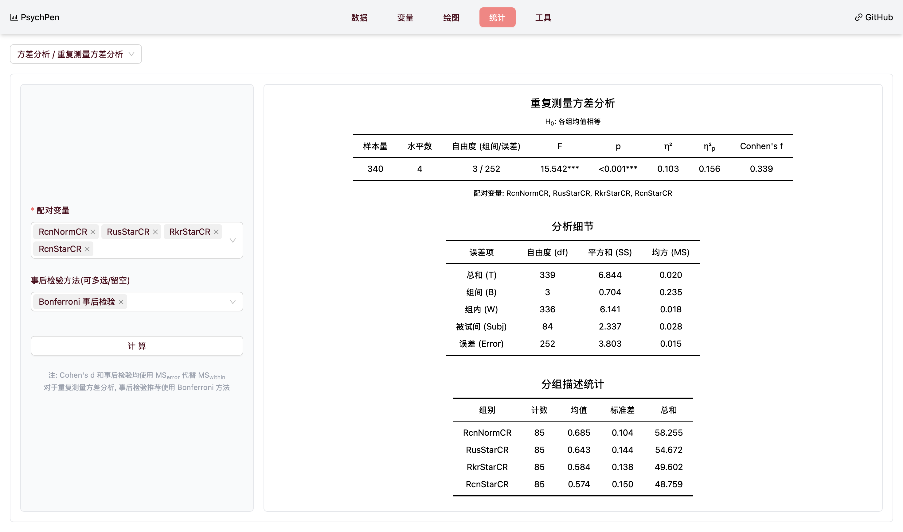 |  |
| :---------------------: | :---------------------: |

### 5.4 非参数检验

检验均值、中位数等"参数"是否有显著差异的方法称为参数检验; 而检验分布、排序等"非参数"是否有显著差异的方法称为非参数检验. 非参数检验不需要数据满足正态分布和方差齐性等前提假设 (一些非参数检验本身就是对这些假设的检验)

#### 5.4.1 Kolmogorov-Smirnov 检验

Kolmogorov-Smirnov 检验用于检验数据是否服从某个分布 (通常是正态分布). 在 Kolmogorov-Smirnov 检验页面中, 你可以选择你要进行检验的变量 (可以一次选择多个), 点击 `计算` 按钮即可进行 Kolmogorov-Smirnov 检验

注意: 结果的 P 值不显著 (大于 0.05) 时, 才说明数据服从正态分布 (因为检验的原假设是"数据服从XX分布")

|       被试内变量       |       被试间变量        |
| :--------------------: | :---------------------: |
| 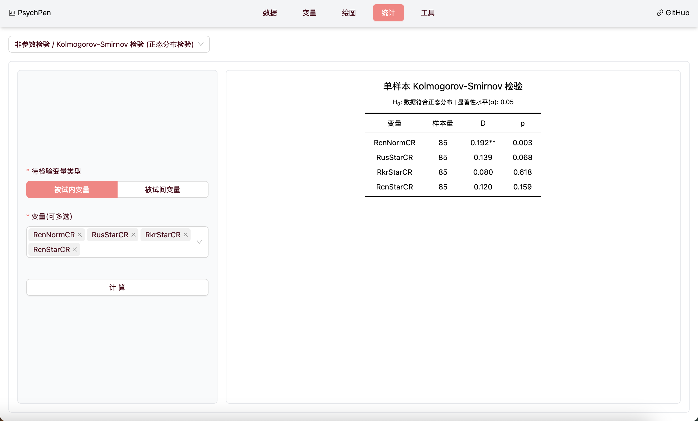 |  |

需要注意的是，显著性检验在⼩样本中（n<30）由于检验⼒的不⾜，即便是偏态分布也可能⽆法检验出来；但在很⼤的样本中（n＞1000）又很敏感，即便有很⼩的峰度或偏度值也会拒绝正态分布的虚⽆假设，但从直⽅图或者正态概率图中直观地看，分布仍然⾮常接近正态分布。因此在检验时需要结合样本量，图形检验，以及峰度或者偏度取值的⼤⼩来综合考虑 (刘红云, 2023)

#### 5.4.2 Levene 检验

Levene 检验用于检验数据是否具有方差齐性. 在 Levene 检验页面中, 你可以选择你要进行检验的变量的类型 (被试内变量/被试间变量). 如果是被试内变量, 你需要选择你要进行检验的变量 (至少选择两个); 如果是被试间变量, 你需要选择你要进行检验的数据变量和分组变量. 点击 `计算` 按钮即可进行 Levene 检验

注意: 结果的 P 值不显著 (大于 0.05) 时, 才说明数据具有方差齐性 (因为检验的原假设是"数据具有方差齐性")

|       被试内变量       |       被试间变量       |
| :--------------------: | :--------------------: |
|  |  |

#### 5.4.3 峰度和偏度检验

峰度和偏度也是检验数据是否服从正态分布的方法之一. 一般来说, 若计算出的偏度或峰度的绝对值大于 1.96, 则说明分布是非正态的; 若偏度显著大于 0, 则说明分布呈正偏态, 反之, 则说明分布呈负偏态; 若峰度显著大于 0, 则说明分布形态尖而高耸, 若峰度显著小于 0, 则说明分布形态较为扁平. 但在实际应用中, 峰度和偏度值的检验容易受样本量的影响, 即样本量大时特别容易拒绝虚无假设. 因此在经验上, 即使虚无假设被拒绝 (即 P 值的绝对值大于 1.96), 若偏度和峰度绝对值较小, 分布仍可近似为正态的 (刘红云, 2023)

|       被试内变量        |       被试间变量        |
| :---------------------: | :---------------------: |
|  |  |

### 5.5 相关和回归

#### 5.5.1 Pearson 相关检验

Pearson 相关检验用于检验两组数据之间的线性相关性. 在 Pearson 相关检验页面中, 你可以选择你要进行检验的变量 (至少选择两个), 点击 `计算` 按钮即可进行 Pearson 相关检验. 除此之外, 你还可以自定义检验方向

结果除了会给出你选择的变量两两之间的各种统计量 (如相关系数、显著性水平、置信区间等), 还会给出一个所有变量之间的相关矩阵 (显示相关系数和显著性水平)


#### 5.5.2 一元线性回归

一元线性回归用于检验一个自变量对一个因变量的影响. 在一元线性回归页面中, 你可以选择你要进行检验的自变量和因变量, 点击 `计算` 按钮即可进行一元线性回归


#### 5.5.3 二元线性回归

标准二元线性回归用于检验两个自变量对一个因变量的影响, 而两个自变量对因变量的共同影响将被排除. 在二元线性回归页面中, 你可以选择你要进行检验的两个自变量和因变量, 并在回归方式中选择 `标准回归`, 点击 `计算` 按钮即可进行标准二元线性回归

序列多元线性回归用于检验多个自变量对一个因变量的影响, 变量进入模型的顺序将影响回归系数, 后进入模型的变量对因变量的影响将排除前面进入模型的变量的影响. 在序列多元线性回归页面中, 你可以选择你要进行检验的多个自变量和因变量, 并在回归方式中选择 `序列回归`, 点击 `计算` 按钮即可进行序列多元线性回归

|    标准二元线性回归     |    序列多元线性回归     |
| :---------------------: | :---------------------: |
|  |  |

#### 5.5.4 多元线性回归

多元线性回归用于检验多个自变量对一个因变量的影响. PsychPen 暂时仅支持标准多元线性回归 (即最小二乘法), 所有自变量同时进入模型, 共同影响将被排除. 在多元线性回归页面中, 你可以选择你要进行检验的多个自变量和因变量, 点击 `计算` 按钮即可进行多元线性回归

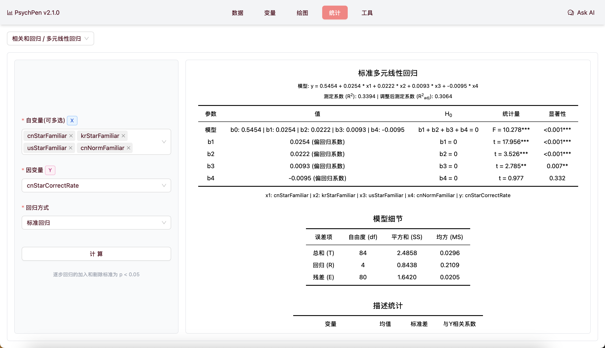

### 5.6 信度分析

信度指测量结果的稳定性, 即多次测量能得到一致的结果. 选择的信度测量方法取决于可能的误差来源, 详见[作者的心理测量学笔记](https://blog.leafyee.xyz/2023/11/02/心理测量学/#x2B50-信度)

#### 5.6.1 重测信度/复本信度

重测信度指同一量表, 同一受测群体, 不同时间, 两次施测, 求积差相关; 复本信度指以两个测验复本来测量同一群体, 然后求受测者群体在这两个测验上得分的积差相关. 在本页面中, 你可以选择你要进行检验的变量 (两个), 点击 `计算` 按钮即可进行重测信度/复本信度检验

你还可以选择分组变量, 以便对不同分组的数据进行信度检验

可以接受的信度临界值取决于研究的具体情况, 如下图所示

|       信度临界值        |        使用演示         |
| :---------------------: | :---------------------: |
|  |  |

#### 5.6.2 分半信度

分半信度指将一个量表分成两半, 每半都包含相同数量的项目, 然后计算两半的得分, 求两半得分的相关系数. 得到的相关系数还需要通过公式修正, 以得到最终的分半信度. 在本页面中, 你可以分别选择两半的变量列表, 点击 `计算` 按钮即可进行分半信度检验

你还可以选择分组变量, 以便对不同分组的数据进行信度检验

|       信度临界值        |        使用演示         |
| :---------------------: | :---------------------: |
|  |  |

#### 5.6.3 同质性信度

如果各个题目是测量同一心理特质, 则各个题目得分间相关越高则信度越好; 同质性信度即是各个题目与总分的相关系数, 常用 alpha 系数表示 (应用中, alpha 的值至少要大于0.5, 最好能大于0.7), 近期也有越来越多的研究使用 omega 系数. 在本页面中, 你可以选择量表的所有题目, 点击 `计算` 按钮即可进行同质性信度检验

你还可以选择分组变量, 以便对不同分组的数据进行信度检验

如果需要计算 omega 系数, 请先在数据视图的 `R语言服务器` 设置中启用 `R语言服务器` 功能


### 5.7 中介效应分析

中介效应分析用于检验一个变量对另一个变量的影响是否通过第三个变量来实现. 详见[作者的心理统计学笔记](https://blog.leafyee.xyz/2024/01/08/心理统计学/#中介效应)

#### 5.7.1 简单中介效应检验

简单中介效应模型只有一个自变量、一个因变量和一个中介变量. 在简单中介效应检验页面中, 你可以选择你要进行检验的自变量、因变量和中介变量, 点击 `计算` 按钮即可进行简单中介效应检验. 你还可以手动设置 Bootstrap 采样次数, 以便得到更准确的中介效应值和置信区间


## 6 工具视图

工具视图中的功能无需导入数据即可食用. 你可在页面上方选择你要使用的工具, 进入对应的工具页面


### 6.1 统计量与P值转换工具

在心理学和教育学研究中, 有时需要将统计量 (如 z 值、t 值、F 值等) 转换为 P 值, 或者将 P 值转换为统计量. 在统计量与P值转换工具中, 你可以输入统计量或 P 值 (t 分布和 F 分布还需要输入自由度), 查看对应的 P 值或统计量结果


### 6.2 正态分布可视化演示工具

正态分布是心理学和教育学研究中经常使用的分布. 在正态分布可视化演示工具中, 你可以调整正态分布(总体)的均值和标准差, 并进行手动或自动(动态演示)抽样, 以便更好地理解正态分布的性质

视图左侧将分别显示 `样本` 和 `总体` 的一些信息, 右侧将显示当前样本的直方图和分布曲线. 底部可以进行 `手动抽样`、`动态演示`、`清除数据` 等操作


### 6.3 T分布可视化演示工具

T分布是假设检验中最常见的分布之一. 在T分布可视化演示工具中, 你可以供抽样的总体(正态分布)的均值和标准差, 以及T分布的自由度(即每次抽样的样本量减1), 并进行手动或自动(动态演示)抽样, 以便更好地理解T分布的性质和"样本均值的标准差"、"估计标准误"、"真实标准误"之间的细微区别

视图左侧将分别显示 `样本` 和 `总体` 的一些信息, 右侧将显示当前样本的直方图和分布曲线. 底部可以进行 `手动抽样`、`动态演示`、`清除数据` 等操作


# PsychPen 开发文档

## 1 项目结构

- `public/` 静态资源目录
- `server/` R 语言服务端目录
- `src/` 源码目录
  - `App.tsx` 根组件
  - `tailwind.css` 全局样式文件
  - `types.d.ts` 类型定义
  - `lib/` 业务逻辑目录
    - `calculates/` 变量处理流程目录
    - `assistant/` AI辅助分析相关目录
    - `utils.ts` 工具函数
    - `useZustand.ts` 全局状态管理
    - `useRemoteR.ts` R语言服务端接口
    - `useAssistant.ts` AI辅助分析接口
    - `useNav.tsx` 导航接口
  - `components/` 组件目录
    - `data/` 数据视图组件
    - `plots/` 绘图视图组件
    - `statistics/` 统计视图组件
    - `tools/` 工具视图组件
    - `variable/` 变量视图组件

## 2 开发说明

1. 克隆本项目到本地

```bash
git clone https://github.com/LeafYeeXYZ/PsychPen.git
cd PsychPen
```

2. 安装依赖 (本项目使用 [bun](https://bun.sh) 作为包管理工具)

```bash
bun install
```

3. 启动项目

```bash
bun dev
```

4. 打包项目

```bash
bun run build
```

> PsychPen 基于 [PsychLib](https://github.com/LeafYeeXYZ/PsychLib) 进行部分统计分析, 基于 [PsychSheet](https://github.com/LeafYeeXYZ/PsychSheet) 进行数据导入导出, 欢迎也关注这两个项目

## 3 R语言服务端部署说明

可以使用以下三种方式部署R语言服务端:

> 请注意, `Safari` 浏览器可能会阻止 `localhost` 的请求, 在本地部署服务端时, 如果遇到 `CORS` 问题, 请使用 `Chrome` 浏览器.

### 3.1 直接拉取镜像运行 (推荐)

```bash
# 如果你的电脑是 arm64 架构
docker run -d -p 8000:8000 leafyee/psych-pen-api:v1.0.1-arm64 # 密码默认为 psychpen
# 如果你的电脑是 amd64 架构
docker run -d -p 8000:8000 leafyee/psych-pen-api:v1.0.1-amd64 # 密码默认为 psychpen
# 访问接口
curl http://localhost:8000/execute -X POST -d '{"password": "psychpen", "code": "1 + 1"}'

# 如果你想自定义密码
docker run -d -p 8000:8000 -e PSYCH_PEN_API_PASSWORD=xxx leafyee/psych-pen-api:v1.0.1-arm64 # 密码为 xxx
```

### 3.2 本地构建和运行

```bash
# 进入服务端目录
cd ./server
# 构建镜像
docker build -t psych-pen-api . # 构建为当前架构的镜像
docker build --platform linux/arm64 -t psych-pen-api . # 构建为 linux/arm64 架构的镜像
docker build --platform linux/amd64 -t psych-pen-api . # 构建为 linux/amd64 架构的镜像
# 运行容器
docker run -d -p 8000:8000 -e PSYCH_PEN_API_PASSWORD=xxx psych-pen-api
# 访问接口
curl http://localhost:8000/execute -X POST -d '{"password": "xxx", "code": "1 + 1"}'
```

### 3.3 直接运行R脚本

```bash
# 进入服务端目录
cd ./server
# 安装依赖
R -e "install.packages('plumber')"
# 运行服务
R -e "library(plumber);pr <- plumb('api.R');pr$run(host='0.0.0.0', port=8000)"
```

## 4 参考文献

- `基础统计` 刘红云. (2023). 教育与心理统计学. 北京师范大学出版社.
- `进阶统计` 刘红云. (2019). 高级心理统计. 中国人民大学出版社.
- `中介效应检验` 方杰, 张敏强, 李晓鹏. (2011). 中介效应的三类区间估计方法. 心理科学进展, 19(5), 765–774.
- `图表库` Li, D., Mei, H., Shen, Y., Su, S., Zhang, W., Wang, J., Zu, M., & Chen, W. (2018). ECharts: A declarative framework for rapid construction of web-based visualization. Visual Informatics, 2(2), 136–146. https://doi.org/10.1016/j.visinf.2018.04.011
